# Provisionamento de Serviços do OCI

## 🎯 Objetivos

Demonstrar de forma prática e ágil o provisionamento das soluções dentro do OCI.

# ⚠️ **ATENÇÃO**:

- **DOWNLOAD:** Faça o download do ZIP ([AQUI](https://objectstorage.sa-saopaulo-1.oraclecloud.com/p/OHxlEJHTMp77MLFBqEHikloZ52nVtURGoqdR78Kk_KCZnKhcS0dsx9rrW_MLFnF4/n/idi1o0a010nx/b/bucket-livelabs-engineering/o/zip_livelabs.zip)), pois os arquivos serão utilizados nos próximos laboratórios.

- **SENHA:** Durante o provisionamento dos recursos, é necessário a criação de senhas. Utilize SEMPRE a senha recomendada: **WORKSHOPsec2019##**

- **COMPARTMENT:** Realize todos os provisionamentos FORA DO compartimento **ROOT**. Considere a criação dos recursos no compartimento criado anteriormente.

### **Aproveite sua experiência na Oracle Cloud!**

## 1️⃣ Validação da Região

1. Faça o login no [Oracle Cloud Infrastructure (OCI)](https://cloud.oracle.com/) e valide se a região de **Chicago** se encontra disponível para uso.

   

## 2️⃣ Criação de Compartimento (SOMENTE SE NÃO HOUVER CRIADO ANTERIORMENTE)

**Como saber se um compartimento já foi criado anteriormente?** ⮕ Siga as instruções abaixo até o passo 2 e verifique se o compartimento já foi criado. Caso já tenha sido criado, não é necessário criar novamente.

1. Clique no menu **(☰)** e selecione **Identity & Security ⮕ Compartments**.
   
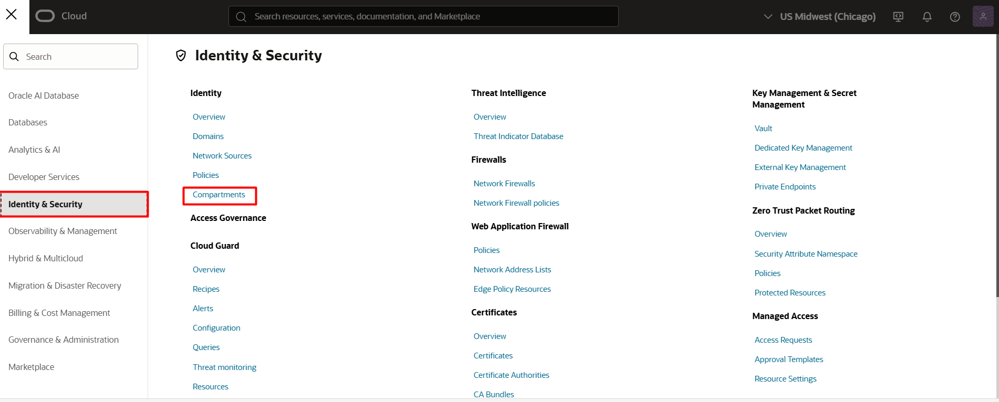

2. Na página de gestão dos compartimentos, clique em **Create Compartment**.

> **ATENÇÃO:** Crie um novo compartimento se houver SOMENTE o compartimento ```<NomeTenancy>(root)``` listado, como indicado abaixo.

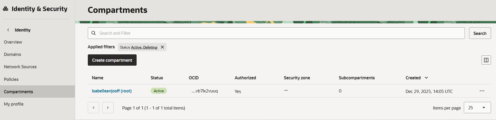

3. Escolha um nome e descrição e clique em **Create Compartment**.

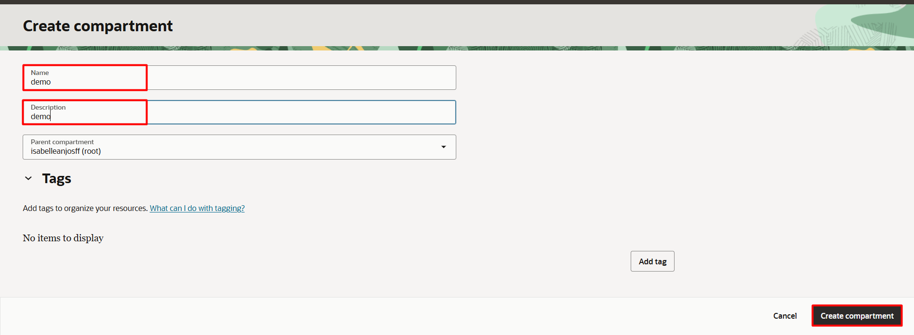

4. ATUALIZE A PÁGINA e o compartimento estará listado como indicado abaixo.


## 3️⃣ Criação de Políticas

Antes de criar o ambiente de código, vamos configurar as permissões necessárias para a interação entre os serviços.

1. Clique no menu **(☰)** e selecione **Identity & Security ⮕ Policies**


2. SELECIONE O COMPARTIMENTO CRIADO e em seguida clique em **Create Policy**. 
> **ATENÇÃO:** SELECIONE O COMPARTIMENTO CRIADO, não selecione o compartimento com nome de ```<NomeTenancy>(root)```
<br> 
  
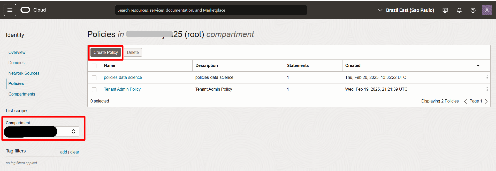

1. Escolha o **Compartment**: <<'NomeTenancy'>>**root**. Em seguida, dê um nome e uma descrição.
 - **NOME: policies-data-science** 
 - **DESCRIÇÃO: Políticas para Data Science**


4.Selecione **Show Manual Editor** e adicione TODAS AS FRASES abaixo. Copie e cole as frases exatamente como estão abaixo, AJUSTANDO SOMENTE PARA O NOME DO SEU COMPARTIMENTO. Em seguida, clique em **Create**.

    <copy>  
    allow any-user to manage objects in compartment <NOME_DO_COMPARTIMENTO>
    allow any-user to manage object-family in compartment <NOME_DO_COMPARTIMENTO>
    allow any-user to manage data-catalog-family in compartment <NOME_DO_COMPARTIMENTO>
    allow any-user to manage dataflow-family in compartment <NOME_DO_COMPARTIMENTO>
    </copy>  
<!-- Separador -->

> **ATENÇÃO:** CONFIRA SE TODOS AS POLÍTICAS INDICADAS ACIMA FORAM ADICIONADAS.


## 4️⃣ Criação de Auth Token

1. A partir de QUALQUER PÁGINA que esteja na cloud, selecione o ícone do seu profile no canto superior direito.

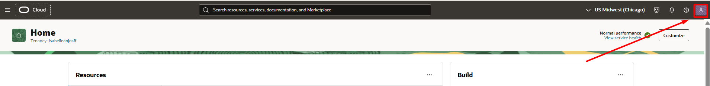

2. Em seguida, clique no seu email.

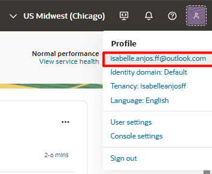

3. Selecione **Tokens and Keys ⮕ Generate Token ⮕ Adicine uma descrição ⮕ Generate Token**

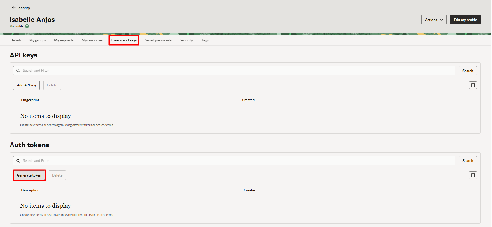

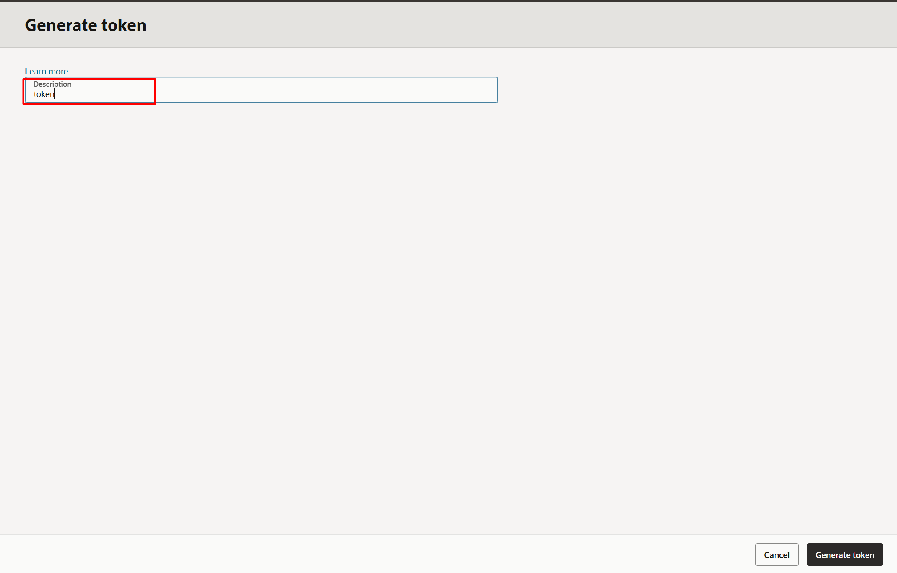

4. Clique nos três pontos e selecione **Copy** e salve o conteúdo em um arquivo de texto. Em seguida, clique em **Close**

> **ATENÇÃO:** **NÃO ESQUEÇA DE SALVAR O TOKEN EM ALGUM ARQUIVO DE TEXTO, POIS O TOKEN NÃO SERÁ MOSTRADO NOVAMENTE. CASO O TOKEN NÃO TENHA SIDO SALVO, RECRIE-O.**

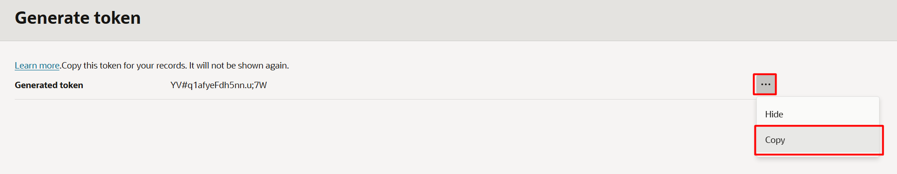

## 5️⃣ Criação do Autonomous Database

Agora iremos criar nosso banco de dados:

1. Clique no menu **(☰)** e selecione **Oracle AI Database ⮕ Autonomous AI Database**.


2. SELECIONE O COMPARTIMENTO CRIADO e em seguida clique em **Create Autonomous AI Database**.
   
> **ATENÇÃO:** Selecione o **Compartment** criado anteriormente. NÃO SELECIONE O COMPARTMENT DE NOME ```<NomeTenancy>(root)```

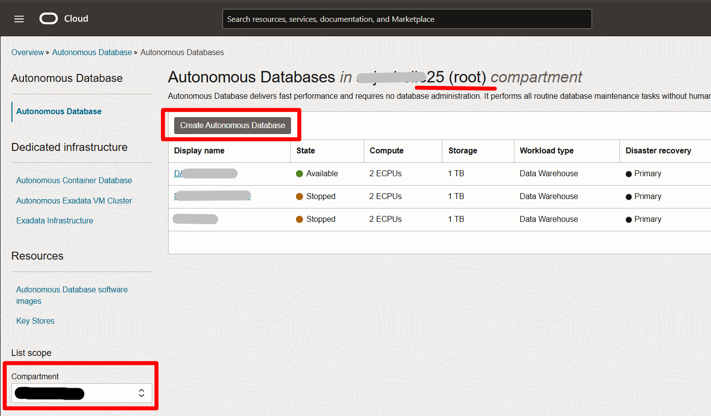
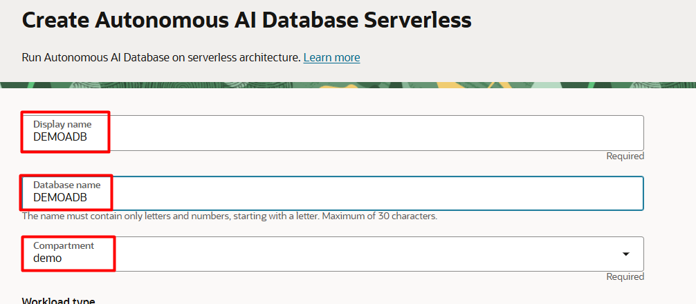

3. Selecione **Lakehouse**
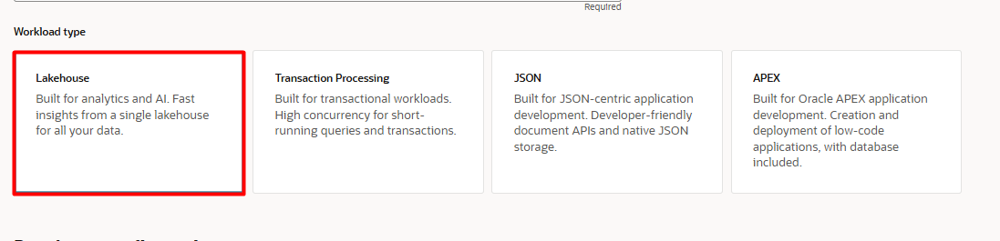

4. Escolha a versão 26ai para o banco de dados.

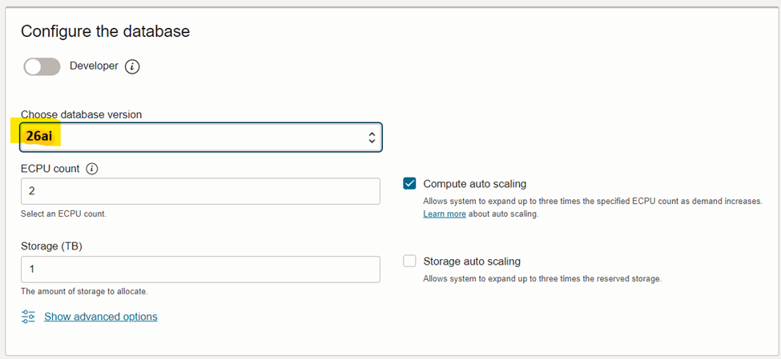

5. Utilize a senha recomendada: **WORKSHOPsec2019##** . Selecione **secure access from everywhere** e clique em **Create Autonomous Database**:
<br><br>

> **ATENÇÃO**: Verifique se utilizou a senha recomendada **WORKSHOPsec2019##**

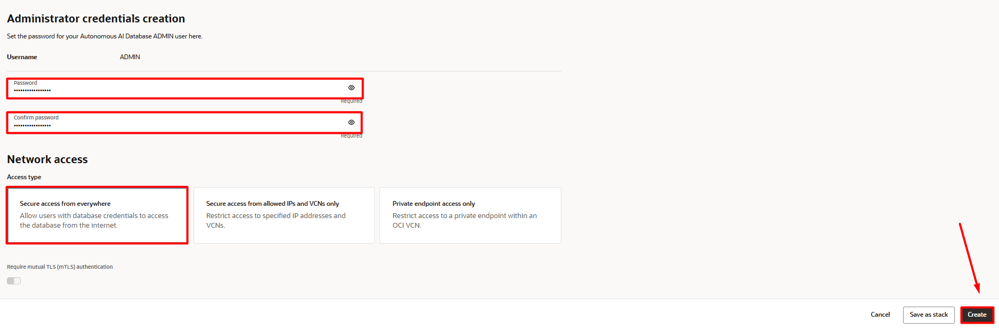

**Vá para o próximo laboratório, não é necessário aguardar a finalização da criação do banco.**

> **Status do Autonomous Database:**
> - Ícone amarelo = Em criação; 
> - Ícone verde = Pronto para uso;


## 6️⃣ Criação de Notebook OCI Data Science

1. Clique no menu **(☰)** e selecione **Analytics & AI ⮕ Data Science**


2. SELECIONE O COMPARTIMENTO CRIADO e em seguida clique em **Create Project**, defina um nome para o projeto e em seguida, clique em **Create**, na região inferior da tela.

> **ATENÇÃO:** Selecione o **Compartment** criado anteriormente. NÃO SELECIONE O COMPARTMENT DE NOME ```<NomeTenancy>(root)```


3. Selecione o nome do projeto e em seguida, clique em **Create Notebook Session**

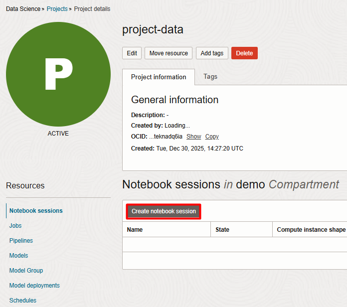

4. Considere as seguintes configurações e em seguida, clique em **Create**:

- **Name:** notebook-data
- **Shape:** VM.Standard.E4.Flex Virtual machine, 1 core OCPU, 16 GB memory. Caso não disponível, selecionar VM.Standard.E5.Flex
- **Network Resources:** Default Networking ⮕ Public Endpoint

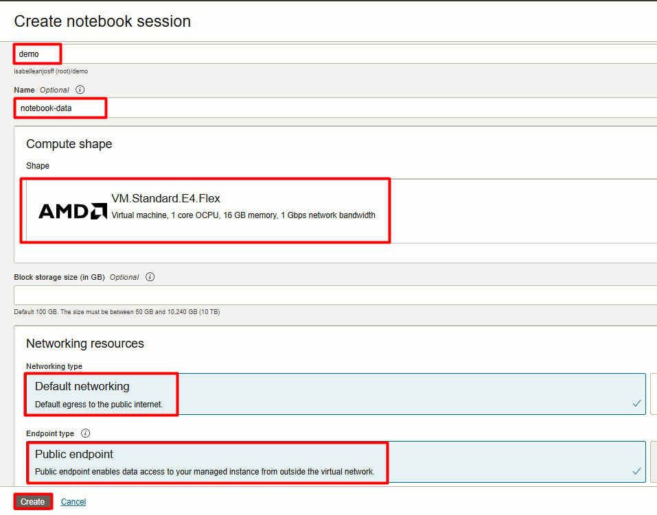

Siga para a próxima etapa abaixo.

## 7️⃣ Criação de Buckets

1. Clique no menu **(☰)** e selecione **Storage ⮕ Buckets**

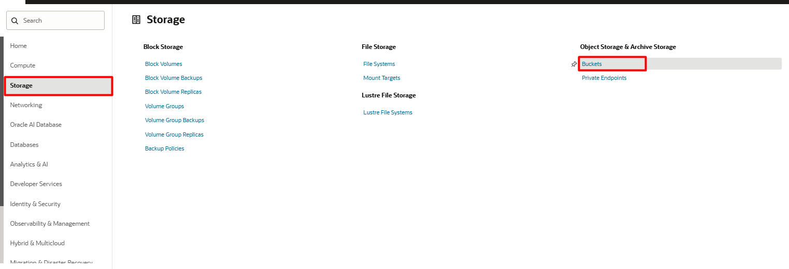

2. Garanta que você está no COMPARTIMENTO CRIADO NA ETAPA 2 DESTE LAB e em seguida clique em **Create Bucket**.

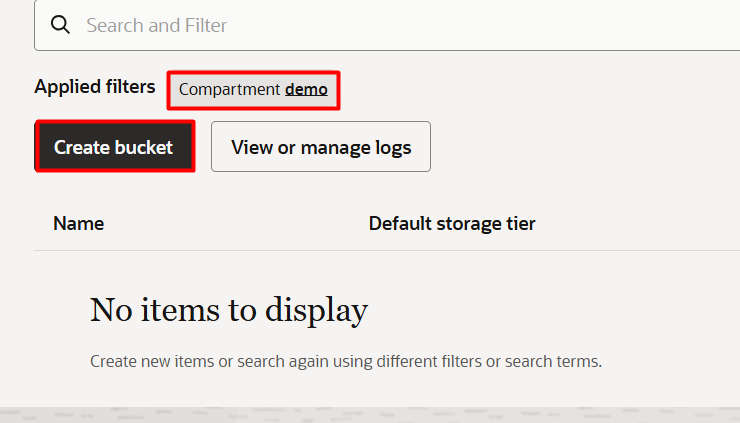

3. Coloque o nome de **bucket-environment-conda** e clique em **Create Bucket**
4. Faça o mesmo passo de criação para os buckets a seguir:
   
   - bucket-bronze
   - bucket-silver
   - bucket-gold
   - bucket-df-logs
   - bucket-metastore
   - bucket-environment-conda (este já está criado)

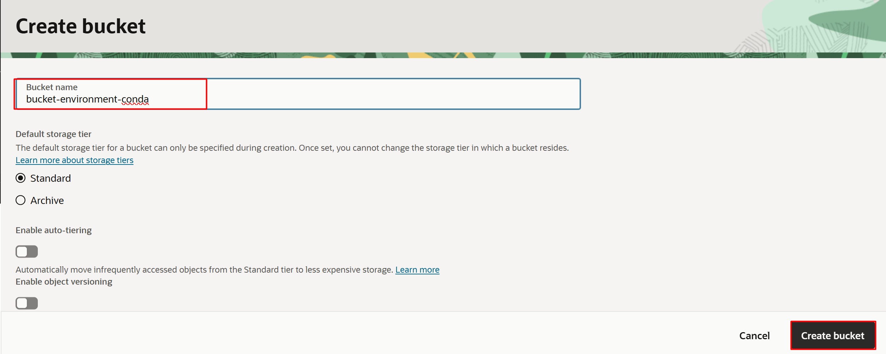

Ao final, você deve ter um total de **6 buckets**

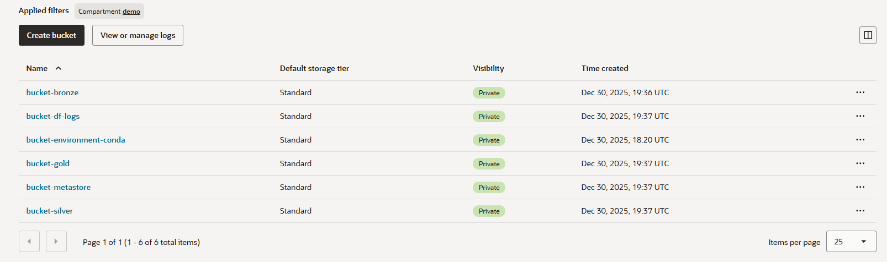

## 8️⃣ Criação de Metastore

1. Clique no menu **(☰)** e selecione **Analytics & AI ⮕ Data Catalog**

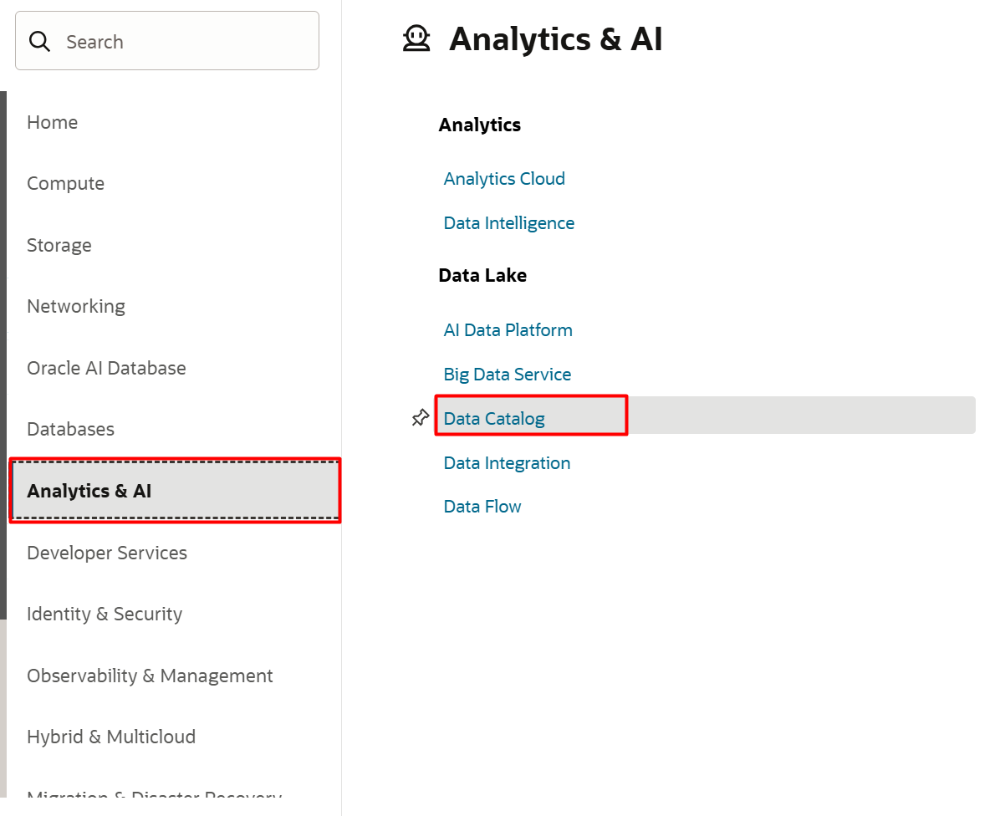

2. Na esquerda, selecione **Metastore**, selecione o compartimento CRIADO NA ETAPA 2 DESTE LABORATÓRIO, e em seguida clique em **Create Metastore**. O NOME DO SEU COMPARTIMENTO PODE ESTAR DIFERENTE DA IMAGEM.

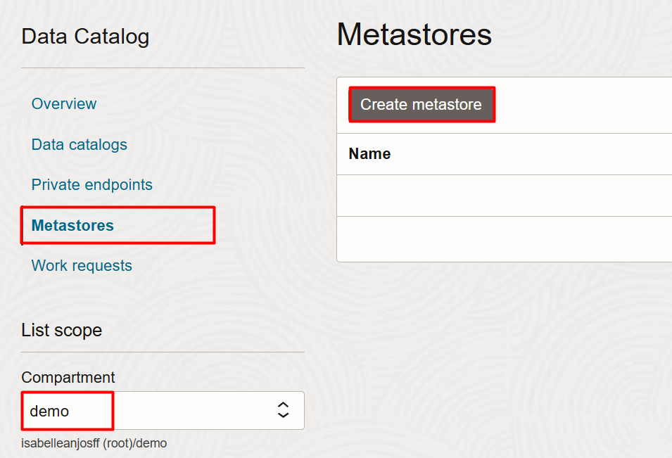

3. Verifique se o seu compartimento está selecionado corretamente. Em seguida, coloque as informações indicadas abaixo:

- **Name:** metastore
- **Default managed table location:** oci://bucket-metastore@<NAMESPACE>
- **Default external table location:** oci://bucket-metastore@<NAMESPACE>

> **ATENÇÃO:** Você deve ajustar o caminho indicado com o NAMESPACE do seu ambiente. Para encontrar esta informação, siga o LABORATÓRIO 5 TAREFA 3 ETAPAS 8 E 9. Por fim, clique em **Create**

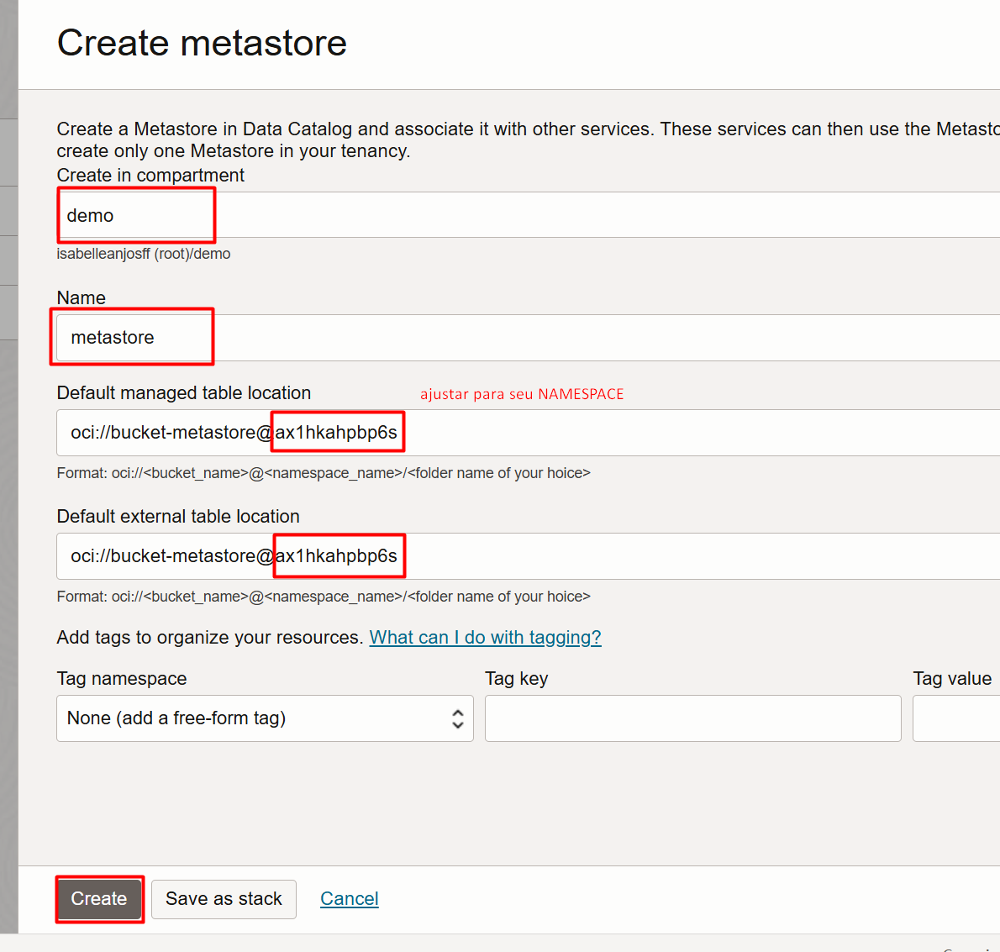

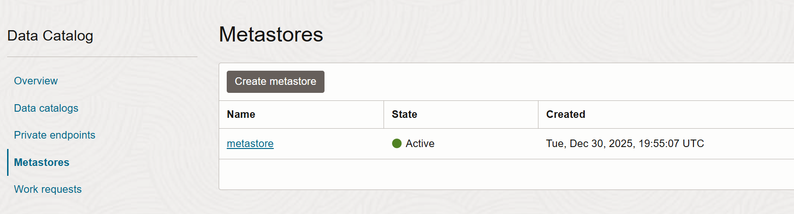

**Vá para o próximo laboratório, não é necessário aguardar a finalização da criação do metastore.**

Você está pronto para prosseguir para o próximo laboratório.

## 9️⃣ [Extra] Como verificar se os serviços já foram criados? 

1. Clique no símbolo da Oracle Cloud, no canto superior esquerdo. Na página inicial, você verá os últimos serviços acessados e o status de cada um, conforme mostrado na imagem a seguir.


### **[OPCIONAL - Verificação Individual]**
Para visualizar cada instância, você pode clicar no nome da instância ou navegar pelo OCI acessando os serviços. Os passos para acessar essas instâncias estão detalhados a seguir.

#### AUTONOMOUS DATABASE

1. Clique no menu **(☰)** e selecione **Database ⮕ Autonomous Database**.


#### OCI DATA SCIENCE

3. Clique no menu **(☰)** e selecione **Analytics & AI ⮕ Data Science**. Selecione seu projeto.


6. Selecione seu Notebook. 


<br>

🎉🎉 Parabéns, você terminou os Laboratórios de **Criação dos Serviços** 🎉🎉

<br>

## 🛡️ Declaração de Porto Seguro (Safe Harbor)

O tutorial apresentado tem como objetivo traçar a orientação dos nossos produtos em geral. É destinado somente a fins informativos e não pode ser incorporado a um contrato. Ele não representa um compromisso de entrega de qualquer tipo de material, código ou funcionalidade e não deve ser considerado em decisões de compra. O desenvolvimento, a liberação, a data de disponibilidade e a precificação de quaisquer funcionalidades ou recursos descritos para produtos da Oracle estão sujeitos a mudanças e são de critério exclusivo da Oracle Corporation.

Esta é a tradução de uma apresentação em inglês preparada para a sede da Oracle nos Estados Unidos. A tradução é realizada como cortesia e não está isenta de erros. Os recursos e funcionalidades podem não estar disponíveis em todos os países e idiomas. Caso tenha dúvidas, entre em contato com o representante de vendas da Oracle. 
