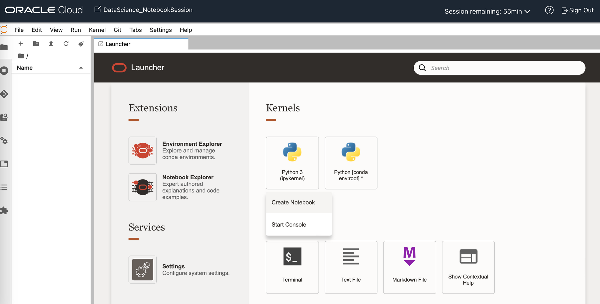
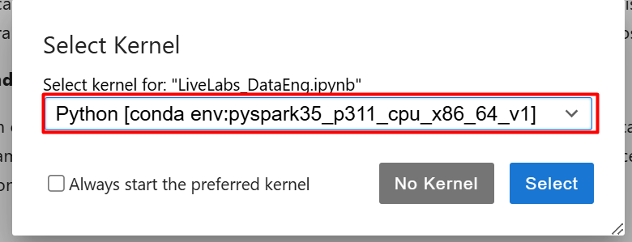

# Configuração do Ambiente Conda no OCI Data Science

## Introdução

Neste laboratório, você vai aprender a **instalar e publicar um Ambiente Conda no OCI Data Science**.

O **OCI Data Science** é a plataforma de ciência de dados da **Oracle Cloud Infrastructure (OCI)**. Ela oferece um ambiente **integrado e colaborativo**, onde cientistas de dados e profissionais podem **criar, gerenciar e compartilhar modelos e análises** de forma simples e eficiente.

Essa plataforma reúne diversas ferramentas que facilitam o trabalho, como:

* **Ambientes de Desenvolvimento Integrados (IDEs):** espaços prontos para escrever, testar e depurar código.
* **Bibliotecas e Frameworks de Machine Learning:** pacotes já instalados que aceleram análises estatísticas, modelagem e aprendizado de máquina.
* **Integração com Armazenamento em Nuvem:** acesso fácil aos dados guardados na OCI para processamento.
* **Colaboração e Compartilhamento:** recursos que permitem trabalhar em equipe e compartilhar modelos e resultados.
* **Notebooks Jupyter:** ferramenta interativa muito usada em ciência de dados, que combina código, visualizações, equações e textos explicativos em um único documento.
* **Ambientes Conda:** no OCI Data Science, você pode criar ambientes personalizados para os notebooks Jupyter, instalando bibliotecas e pacotes específicos para o seu projeto.

Dentro desse fluxo, um elemento essencial são os **kernels**. Eles funcionam como o **coração do projeto no Jupyter Notebook**, carregando todas as ferramentas necessárias para rodar o código. Ao configurar um **Ambiente Conda**, você cria um **kernel personalizado**, ou seja, um espaço de trabalho feito sob medida. Isso permite adicionar todas as bibliotecas e pacotes específicos que seu projeto precisa, garantindo que os notebooks operem de forma eficiente e ajustada às suas tarefas.

Em resumo, o **OCI Data Science** reúne tudo o que você precisa em um só lugar, tornando o processo de desenvolver projetos de dados mais **organizado, prático e colaborativo**.

**O papel do OCI Data Science será funcionar com uma interface gráfica para interagirmos com o OCI Data Flow, isso facilitará muito no desenvolvimento, testes e exploração dos nossos dados. Todas as etapas abaixo são para a configuração desse ambiente.**

*Tempo estimado para o Lab:* 15 Minutos

### _Objetivos_

* Instalar o ambiente PySpark no OCI Data Science
* Publicar o ambiente instalado
* Importar o Notebook para utilização

[Oracle Video Hub video scaled to Large size](videohub:1_he6e7ril:large)

### _Download do Repositório_

Como primeiro passo, devemos fazer o download do arquivo (zip).

**ATENÇÃO: Se você já realizou o download no primeiro laboratório, não é necessário realizar novamente.**

Acesse o link para fazer o download: [**AJUSTAR LINK**]().
    
Neste momento, iremos utilizar os arquivos abaixo:
* Livelabs\_DataEng.ipynb
* CODIGO_NCM.xlsx
* CODIGO_VIA.csv
* EXPORTACAO\_BRASIL\_LIVELABS.csv
* CODIGO\_PAISES\_LIVELABS.json

## Tarefa 1: Acesso ao OCI Data Science

1.	Selecione o menu na região superior esquerda.

    

2.	Em seguida, selecione a opção **Analytics & AI**:

    

3.	Neste menu, selecione a opção **Data Science**:

    

4.	Na parte inferior esquerda da tela, você verá a seção **compartments**. Certifique-se de que o compartimento CRIADO NO LAB 1 TAREFA 2 está selecionado. O NOME DO SEU COMPARTIMENTO PODE ESTAR DIFERENTE DO INDICADO NA IMAGEM.

    

5. Abra o projeto que contém o notebook de data science. O NOME DO SEU PROJETO PODE ESTAR DIFERENTE DO INDICADO NA IMAGEM.

    

6. Nesta página, selecione o notebook criado.  O NOME DO SEU NOTEBOOK PODE ESTAR DIFERENTE DO INDICADO NA IMAGEM.

    

7. Em seguida, para abrir o notebook de data science, selecione **Open**.

    

8. Você precisará se autenticar novamente, pois estamos entrando dentro do ambiente do serviço.

    

## Tarefa 2: Instalação do ambiente Conda

1.	Na página inicial do Data Science, clique em **Environment Explorer**.

    

2.	Selecione os três pontos ao lado direito do ambiente Conda chamado **PySpark 3.5 and Data Flow** na Environment Version 3.0.

    

3. Clique em **Install**.
   
    

4. Uma janela do terminal irá abrir, apresentando o progresso da instalação. AGUARDE A FINALIZAÇÃO DA INSTALAÇÃO indicado pela mensagem **"INFO:ODSC:Conda environment has been successfully installed."** 
   
    

## Tarefa 3: Publicação do ambiente Conda

A publicação do ambiente é motivada por vários princípios importantes:

- **Compartilhamento e Colaboração:** Publicar o ambiente em um bucket permite que outros membros da equipe ou colaboradores acessem e utilizem o mesmo ambiente. Isso garante a consistência em projetos colaborativos, onde todos estão trabalhando com as mesmas bibliotecas e versões de pacotes.

- **Backup e Recuperação:** Tendo o ambiente armazenado em um bucket, você tem um backup seguro. Isso significa que, em caso de falhas ou problemas no sistema local, você pode facilmente restaurar o ambiente a partir do bucket.

- **Portabilidade:** Ao armazenar o ambiente Conda em um bucket, ele pode ser acessado de diferentes máquinas ou instâncias na nuvem. Isso permite que cientistas de dados ou desenvolvedores trabalhem em diferentes ambientes (local, nuvem, diferentes máquinas) sem ter que reconfigurar ou reinstalar o ambiente de cada vez.

Desta forma, vamos iniciar com o processo de publicação:

1. Para publicar este ambiente, retorne para a janela do launcher ou utilize o atalho **CTRL + SHIFT + L** para abrir um novo launcher.

    

2. No launcher, selecione **Settings**, na área de Extensions.

    

3. Para prosseguir, será necessário obter informações específicas sobre o bucket, ou seja, a pasta de arquivos onde o ambiente será hospedado.

    

4. Para encontrar estas informações, clique no **nome do notebook** na área superior esquerda da página para retornar para o ambiente da Oracle Cloud.

    

5. Na página das informações do notebook, clique no menu na área superior esquerda da página.

    

6. Use o menu suspenso do console web OCI para acessar **Storage** e, em seguida, **Buckets**.

    

7. Certifique-se de que estamos usando o compartimento CRIADO NO LAB 1 TAREFA 2 para o bucket que iremos acessar. O NOME DO SEU COMPARTIMENTO PODE ESTAR DIFERENTE DA IMAGEM.

    

8. Em seguida, selecione o **bucket-environement-conda**. O NOME DO SEU COMPARTIMENTO PODE ESTAR DIFERENTE DA IMAGEM.

    

9. Nesta página, você encontrará o **namespace** e o **Nome do Bucket** que são requisitados na página de configurações do Oracle Data Science.

    

10. Retorne para a guia do navegador no qual o Data Science está aberto e insira as informações solicitadas. Em seguida, clique em **Save**.

    

> Se o procedimento for finalizado corretamente, uma mensagem de sucesso será exibida. 
    

11. Em settings, selecione o botão **X** para retornar para a página principal do Launcher.

    

12. O ambiente instalado **PySpark 3.2 and Data Flow** estará presente na área **Kernels**. Selecione-o com o botão esquerdo e em seguida, clique na opção **Publish**.

    

---

13. Uma janela do terminal irá abrir, apresentando o progresso da publicação. Aguarde até aparecer a mensagem: **INFO:ODSC:/home/datascience/conda/tmp/pyspark32\_p38\_cpu\_v3.tar.gz uploaded successfully.**

    

---

## Tarefa 4: Importação do Notebook Data Science

1. Realize o download do Notebook Data Science na introdução deste laboratório.

2. Para realizar o upload do notebook no ambiente Data Science, clique no ícone de upload na região superior esquerda da página e selecione o arquivo **Livelabs\_DataEng.ipynb** em sua pasta local.

    

3. Em seguida, dê dois cliques no nome do arquivo para acessar o notebook.

    

4. Selecione o kernel que você acabou de instalar e publicar:

    

## Tarefa 5: Upload dos dados brutos no bucket Bronze

**Faça o download dos 4 arquivos abaixo na introdução deste laboratório:**
* CODIGO_NCM.xlsx
* CODIGO_VIA.csv
* EXPORTACAO\_BRASIL\_LIVELABS.csv
* CODIGO\_PAISES\_LIVELABS.json

1. Selecione o menu na região superior esquerda, em seguida clique em storage e selecione Buckets.

    

2. Acesse o bucket chamado **bucket-bronze**.

    

3. Na parte inferior da tela clique no botão **Upload**. Em seguida clique em **Select Files**.

    

4. Selecione os arquivos que você baixou no inicio dessa tarefa.

    

5. Após selecionar os arquivos clique em **Upload**.
   
> **ATENÇÃO:** OS ARQUIVOS DEVEM ESTAR EXATAMENTE COM O MESMO NOME INDICADO NA IMAGEM, SEM (1) OU OUTRA NOMENCLATURA. O ARQUIVO CÓDIGO_NCM É CSV.

6. Verifique se os 4 arquivos estão em seu bucket:

    

Parabéns, você terminou esse laboratório! 🎉

Você pode **seguir para o próximo Lab**.

## Conclusão

Neste laboratório, você aprendeu a instalar e publicar um ambiente Conda, além de importar um notebook no ambiente do Oracle Cloud Data Science, habilidades essenciais para utilizar em seus projetos de ciência de dados.

## Autoria

- *Created By/Date* - Thais Henrique, Heloisa Escobar, Isabelle Anjos, Janeiro 2024
- *Last Updated By* - Isabelle Anjos, Outubro 2025