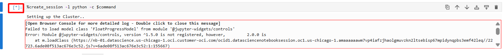

# Configuração do Data Flow Studio no OCI Data Science

## Introdução

>⚠️ **ATENÇÃO** ⚠️
 
>**DOWNLOAD:** Faça o download do ZIP ([AQUI](https://objectstorage.sa-saopaulo-1.oraclecloud.com/p/aR4psHuDVUTRKxcK7ooD2JThAZg8ZrwHVM_qFKmSXsLSz_S_kXNkTBQ4QDOJy5VA/n/idi1o0a010nx/b/bucket-livelabs-engineering/o/livelabs.zip)), pois os arquivos serão utilizados nos laboratórios. Se você já realizou o download no primeiro laboratório, não é necessário realizar novamente.
 
>**SENHA:** Durante o provisionamento dos recursos, é necessário a criação de senhas. Utilize SEMPRE a senha recomendada: **WORKSHOPsec2019##**
 
> **COMPARTMENT:** Realize todos os provisionamentos FORA DO compartimento **ROOT**. Considere a criação dos recursos no compartimento criado anteriormente.

Neste laboratório, você vai aprender a **configurar uma sessão no Data Flow Studio**, um componente integrado ao **OCI Data Science**.

O ambiente que será configurado é a **OCI Data Flow Session**, onde você poderá **processar dados de forma interativa**, desenvolvendo, testando e otimizando fluxos em tempo real. 

### *O que é o Data Flow?*

---

O **OCI Data Flow** é um **serviço totalmente gerenciado** da Oracle Cloud Infrastructure (OCI) que executa **scripts Apache Spark** sem a necessidade de instalar software ou gerenciar infraestrutura. Ele é projetado para lidar com **grandes volumes de dados** de maneira simples e escalável, permitindo que os usuários se concentrem apenas na escrita de seus scripts.
Com ele, é possível criar aplicações em **Java, Scala, Python ou SQL**, ideais para tarefas como:

* Processamento em lote de dados
* Operações de ETL (Extract, Transform, Load)

A principal vantagem do OCI Data Flow é sua **escalabilidade e facilidade de uso**, acelerando o desenvolvimento sem preocupações com a infraestrutura subjacente.

### *O que é o Data Flow Studio?*

---

Já o **Data Flow Studio** é uma **extensão integrada ao OCI Data Science**, que adiciona uma **camada interativa** para usar todo o poder do Data Flow em conjunto com outras ferramentas de ciência de dados.
Ele é especialmente útil para realizar **operações de ETL via código**, oferecendo flexibilidade para:

* Extrair dados de diferentes fontes,
* Transformá-los conforme a necessidade do projeto,
* E carregá-los em destinos apropriados.

| **OCI Data Flow**                                                     | **OCI Data Flow Studio**                                                                   |
| --------------------------------------------------------------------- | ------------------------------------------------------------------------------------------ |
| Serviço totalmente gerenciado para executar **scripts Apache Spark**. | Extensão do Data Flow integrada ao **OCI Data Science**.                                   |
| Não exige instalar software nem gerenciar infraestrutura.             | Oferece um **ambiente de desenvolvimento na nuvem (IDE)**.                                 |
| Escalável para processar **grandes volumes de dados**.                | Permite **construir, testar e executar** aplicações Spark de forma prática.                |
| Suporta aplicações em **Java, Scala, Python e SQL** no Spark.         | Disponibiliza **interface gráfica** para interação mais intuitiva.                         |
| Ideal para **processamento em lote, ETL e análises complexas**.       | Indicado para uma abordagem mais **visual e interativa** na criação de pipelines de dados. |

### *Observação:*

---

Quando você iniciar o notebook *`LiveLabs.ipynb`*, encontrará no sumário uma relação completa dos assuntos que serão explorados durante os laboratórios 2 e 3.

> Para executar o código de qualquer célula no notebook, primeiro selecione a célula que deseja executar. Em seguida, você pode pressionar *`SHIFT + ENTER`* no teclado ou clicar no botão de execução (ícone de 'play') no notebook para realizar a ação.  

*Tempo estimado para o Lab:* 10 Minutos

### Objetivos

* Compreender a estrutura e funcionalidades de um notebook Jupyter.
* Aprender os atalhos de teclado e comandos específicos do ambiente OCI Data Science.
* Dominar o processo de autenticação usando o Oracle Accelerated Data Science SDK.
* Entender como configurar e utilizar variáveis de ambiente importantes no notebook.
* Aprender a usar comandos mágicos para interação com o Apache Spark.
* Desenvolver competências para criar, monitorar e verificar o status de sessões do Spark.

## Aprendendo sobre Notebook Jupyter e comandos OCI Data Science

### *Como funciona um Notebook Jupyter:*

---

No último laboratório, importamos um **notebook Jupyter** para utilizá-lo no ambiente de Data Science. Mas afinal, **o que é um notebook Jupyter e como ele funciona?**

Um notebook Jupyter é uma das ferramentas mais populares entre **cientistas de dados, engenheiros e analistas**, pois combina **código, explicações em texto, gráficos e visualizações** em um único documento interativo.

---

### **Células**

O notebook é organizado em **blocos chamados células**, que podem ser de dois tipos principais:

* **Células de Código:** permitem escrever e executar código em linguagens como *Python, R ou PySpark*. Ao rodar a célula (com `Shift + Enter`), o resultado aparece logo abaixo.
* **Células de Markdown:** usadas para escrever explicações, adicionar imagens, links, tabelas ou listas. O Markdown é uma linguagem de marcação simples que permite formatar textos (negrito, itálico, listas, etc.) e até incluir trechos em HTML.

---

### **Execução Interativa**

O grande diferencial do Jupyter é a **interatividade**. Você pode alterar um trecho de código, executar apenas aquela célula e ver o resultado imediatamente — sem precisar rodar o notebook inteiro. Essa flexibilidade facilita testes, experimentos rápidos e aprendizado prático.

---

### **Versatilidade**

Os notebooks são usados em diversas situações:

* **Análise de dados e visualizações**
* **Modelagem estatística e machine learning**
* **Criação de tutoriais, experimentos e guias educacionais**

---

### **Compartilhamento e Colaboração**

Notebooks podem ser salvos no formato `.ipynb`, facilmente **compartilhados em plataformas como GitHub** ou executados em ambientes de nuvem, como o **OCI Data Science**, permitindo colaboração entre equipes.

 

### *Comandos OCI Data Science*

---

Segue uma relação de comandos disponíveis no ambiente do OCI Data Science. Para usar esses atalhos, você precisa estar em modo de comando (pressionando Esc antes do atalho):

| Atalho de Teclado               | Ação                                       |
|---------------------------------|--------------------------------------------|
| `Shift + Enter`                 | Executar a célula atual e ir para a próxima|
| `Ctrl + Enter`                  | Executar a célula atual                    |
| `Alt + Enter`                   | Executar a célula atual e inserir uma nova |
| `Esc` e depois `A`              | Inserir célula acima                       |
| `Esc` e depois `B`              | Inserir célula abaixo                      |
| `Esc` e depois `D`, `D`         | Excluir célula atual                       |
| `Esc` e depois `M`              | Mudar célula atual para tipo Markdown      |
| `Esc` e depois `Y`              | Mudar célula atual para tipo Código        |
| `Esc` e depois `L`              | Alternar números de linha                  |
| `Esc` e depois `C`              | Copiar célula                              |
| `Esc` e depois `X`              | Cortar célula                              |
| `Esc` e depois `V`              | Colar célula abaixo                        |
| `Esc` e depois `I`, `I`         | Interromper a execução da célula           |

## Tarefa 1: Autenticação

Para que a análise de dados no Data Flow Studio seja segura e eficiente, é fundamental configurar corretamente os métodos de autenticação. Nesta seção, vamos explorar o Tópico 1 do notebook, dedicado a esse processo.

O Oracle Accelerated Data Science SDK (ADS) controla o mecanismo de autenticação com o cluster Spark em uma Sessão do OCI Data Flow. Para configurar a autenticação, utilizamos *`ads.set_auth("resource_principal")`*

O parâmetro *`resource_principal`* indica que está sendo utilizado um método de autenticação específico, associado a recursos e políticas de segurança dentro da infraestrutura da Oracle Cloud. Assim, o código está preparando o ambiente para que o usuário possa interagir de forma segura com o Spark, garantindo que todas as operações realizadas estejam autenticadas e autorizadas de acordo com as configurações do OCI Data Science.

1. **Selecione a célula e execute-a com o comando SHIFT + ENTER, ou clique no botão de execução (ícone de 'play') no notebook.**

    

O código abaixo realiza a autenticação para usar serviços da Oracle Cloud Infrastructure, especialmente o Data Flow Studio. Ele importa bibliotecas necessárias, incluindo o SDK da OCI, e configura um assinante de princípios de recursos, que permite fazer solicitações autenticadas aos serviços da OCI sem gerenciar manualmente as credenciais.

2. **Selecione a célula e execute-a com o comando SHIFT + ENTER, ou clique no botão de execução (ícone de 'play') no notebook.**

    

## Tarefa 2: Criação de Variáveis

Este código está configurando algumas variáveis importantes para serem utilizadas durante a *criação da sessão Spark*. 

1. **Selecione a célula e execute-a com o comando SHIFT + ENTER, ou clique no botão de execução (ícone de 'play') no notebook.**

    

### *Informação sobre o compartment ID*

Primeiramente, ele importa a biblioteca *`os`*, que permite trabalhar com variáveis de ambiente do sistema operacional. Com isso, ele obtém o valor da variável de ambiente *`NB_SESSION_COMPARTMENT_OCID`*, que é usada para identificar o compartimento específico na Oracle Cloud Infrastructure (OCI) onde o notebook está armazenado. Esse valor é então armazenado na variável *`compartment_id`*.

### *Informação sobre o bucket namespace*

Esse código configura um cliente para acessar o serviço de armazenamento de objetos da Oracle Cloud Infrastructure (OCI) e obtém o namespace do bucket de armazenamento. O cliente é inicializado com configurações padrão e autenticação baseada no assinante configurado anteriormente. Em seguida, ele chama o método para obter o *namespace do bucket*, que é um identificador único usado na OCI para organizar e separar recursos de armazenamento.

### *Informação sobre o nome dos buckets*

O código lista todos os buckets em um namespace e compartimento específicos da Oracle Cloud Infrastructure. Em seguida, ele procura e armazena os nomes dos primeiros buckets encontrados que contêm 'logs' e 'conda' em seus nomes, respectivamente, em duas variáveis diferentes.

### *Informação sobre o Metastore ID*

Esta etapa do código configura um cliente para o Data Catalog da OCI, lista os metastores em um compartimento especificado e extrai o ID do primeiro metastore encontrado, armazenando-o em uma variável.

## Tarefa 3: Data Flow Spark Magic

### *Apache Spark e Data Flow*

O **Apache Spark** é uma plataforma *open source* (código aberto) criada para o **processamento de grandes volumes de dados**. Por ser livre e modificável, conta com uma comunidade ativa que contribui constantemente para seu aprimoramento.

No **OCI Data Flow**, serviço da Oracle Cloud Infrastructure, o Spark é o **motor de processamento de dados que funciona por trás das operações**. Ou seja, sempre que você executa análises, processa grandes quantidades de dados (*big data*) ou roda operações complexas dentro do Data Flow, está utilizando a capacidade do Spark.

Uma das maiores vantagens do Spark é sua habilidade de **distribuir tarefas entre vários computadores em um cluster**, acelerando o processamento. Isso o torna perfeito para ambientes em nuvem, como o OCI, onde **escalabilidade e eficiência** são fundamentais.

Com essa integração, o OCI Data Flow permite que usuários executem **processamento de dados em larga escala, análises estatísticas avançadas e algoritmos de machine learning** de forma simples e eficiente, aproveitando toda a robustez da infraestrutura da Oracle Cloud.

### *Helpers*

---

O código apresentado define uma função auxiliar chamada `prepare_command`, uma ferramenta de conveniência para transformar argumentos que são armazenados em variáveis Python ou estruturas de dados em uma forma que pode ser utilizada pelos comandos mágicos do Spark, que muitas vezes esperam argumentos em formato de string.

1. **Selecione a célula e execute-a com o comando SHIFT + ENTER, ou clique no botão de execução (ícone de 'play') no notebook.**

    

Esses comandos mágicos permitem interagir de maneira eficiente com o Spark, facilitando a execução de operações complexas de processamento de dados de forma mais simplificada e integrada dentro do ambiente do notebook Jupyter. 

### *Data Flow Spark Magic*

---

O Data Flow Spark Magic refere-se a uma coleção de "comandos mágicos" especializados no Jupyter Notebook que facilitam a interação com *Apache Spark*. Esses comandos são possíveis graças à integração com a API REST do Apache Livy, um serviço que permite a submissão de trabalhos Spark de forma remota.

> O código Spark escrito nos notebooks Jupyter é executado em clusters Spark hospedados remotamente, permitindo lidar com grandes conjuntos de dados e tarefas de processamento intensivo.

Você precisa ativar o  Data Flow Spark Magic em seu notebook usando o comando mágico *`%load_ext dataflow.magics.`*

2. **Selecione a célula e execute-a com o comando SHIFT + ENTER, ou clique no botão de execução (ícone de 'play') no notebook.**

    

Após a ativação da extensão, o comando *`%help`* pode ser usado para obter a lista de todos os comandos disponíveis, juntamente com uma lista de seus argumentos e exemplos de chamadas.

3. **Selecione a célula e execute-a com o comando SHIFT + ENTER, ou clique no botão de execução (ícone de 'play') no notebook**.

    

> **[OPCIONAL] Doctring**: Para entender o propósito e os argumentos de um comando mágico no Jupyter Notebook, você pode adicionar um *`?`* ao final do comando, o que exibirá a docstring, um texto explicativo incorporado no código que fornece detalhes sobre sua funcionalidade. 

## Tarefa 4: Criando uma Sessão

Neste momento do tutorial, vamos reutilizar algumas variáveis que foram criadas anteriormente na **Tarefa 3**. Vamos integrá-las na criação da sessão do Data Flow Studio.

Para criar uma nova sessão de cluster do Data Flow, vamos utilizar o comando mágico *`%create_session`*.
De forma geral, este comando está configurando e iniciando uma nova sessão de cluster do Data Flow no OCI Data Science, especificando detalhes como o tipo de máquina virtual, configurações de CPU e memória, versão do Spark, e onde armazenar os logs. 

1. **Selecione cada uma das células e execute-as com o comando SHIFT + ENTER, ou clique no botão de execução (ícone de 'play') no notebook**.

    

    

Vamos decompor cada parte para uma explicação mais simples:

### *Comando Mágico %create_session:*

---

Este é um comando especial Data Flow Magic usado no Jupyter Notebook para iniciar uma nova sessão do Data Flow.

Opções do Comando:

- *-l python:* Especifica a linguagem de programação a ser usada, neste caso, Python.
- *-c '{...}':* Contém a configuração em formato JSON para a sessão do Data Flow.

#### *Configurações da Sessão:*

---

- *"compartmentId":* Identificador do compartimento na OCI onde a sessão será criada.
- *"displayName":* Nome da sessão para identificação. Pode ser alterado livremente.
- *"language":* Define a linguagem de programação (Python).
- *"sparkVersion":* Especifica a versão do Spark a ser usada.
- *"numExecutors":* Número de executores para o Spark. Os executores são processos que executam tarefas e armazenam dados para o aplicativo Spark.
- *"driverShape" e "executorShape":* Especificam o tipo de máquina virtual (VM.Standard.E4.Flex) usada para o driver e os executores, respectivamente. O driver é o processo central que coordena as tarefas do Spark.
- *"driverShapeConfig" e "executorShapeConfig":* Configurações detalhadas para o driver e os executores, incluindo o número de CPUs (OCPUs) e a quantidade de memória (em GBs).
- *"logsBucketUri":* Endereço do bucket (contêiner de armazenamento) na OCI onde os logs da sessão serão armazenados.
- *"configuration":* Configurações adicionais, como a localização do ambiente do Spark e outras opções de configuração.
- *"metastoreId":* Um identificador para o metastore de dados usado. Um metastore é um repositório central para armazenar metadados sobre as estruturas de dados, como tabelas e esquemas, dentro do ambiente Spark.

2. **Depois de executar a célula que contém o comando mágico, aguarde a criação da sessão Spark.**

    

    A sessão do Spark estará pronta para ser utilizada assim que a seguinte mensagem for exibida.

    **ATENÇÃO: Este processo pode demorar alguns minutos (15-25 min).**

    Cada vez que você cria uma nova sessão, um novo "Session ID" é atribuído a essa sessão, permitindo que o ambiente de cluster diferencie entre múltiplas sessões que podem estar ocorrendo simultaneamente. Esse ID pode ser utilizado para retomar, gerenciar ou encerrar a sessão específica a qualquer momento.

    

    > **OBSERVAÇÃO:** Não se preocupe se não aparecer a barra de progresso como na imagem abaixo, a indicação que está sendo criado é o asterisco (*) no lado esquerdo da célula. Aguarde até que ele seja substituído por um número, indicando que a célula foi processada.

    

3. **Utilize o comando mágico *`%status`* para verificar o status da sessão atual.**

    

> **Nota:** Os clusters da Sessão do OCI Data Flow ficam ativos por 24 horas (1440 minutos) por padrão, porém você pode customizar esse período para criar sessões que permanecerão ativas por até 7 dias (10,080 minutos) (maxDurationInMinutes).

Parabéns, você terminou esse laboratório! 🎉

Você pode **seguir para o próximo Lab**.

## Conclusão

Nesta laboratório, você aprendeu como utilizar notebooks Jupyter no OCI Data Science para criar e gerenciar sessões do Data Flow com Apache Spark, abrangendo desde autenticação e configuração de variáveis até a execução interativa de código e monitoramento do status do cluster.

## Autoria

- *Created By/Date* - Thais Henrique, Heloisa Escobar, Isabelle Anjos, Janeiro 2024
- *Last Updated By* - Isabelle Anjos, Outubro 2025