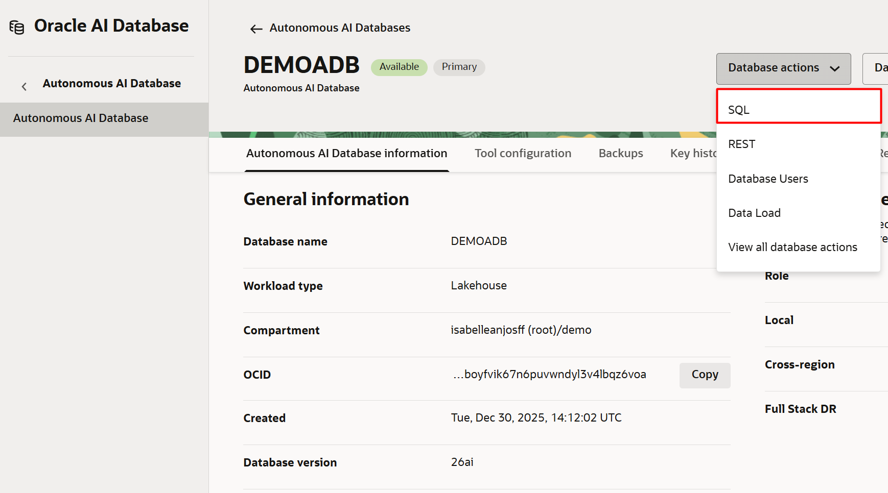
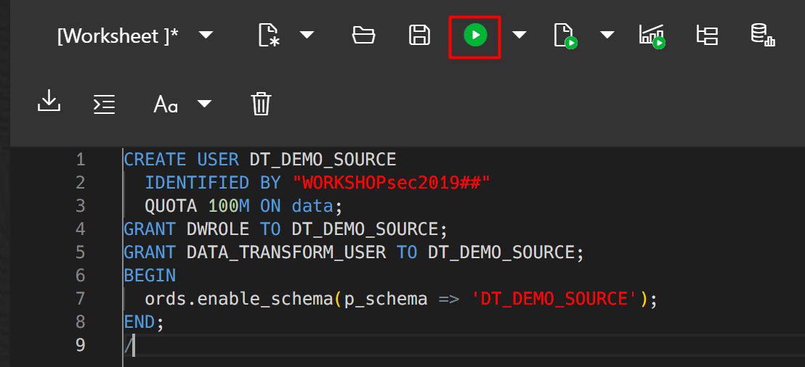
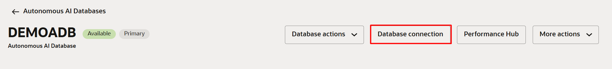
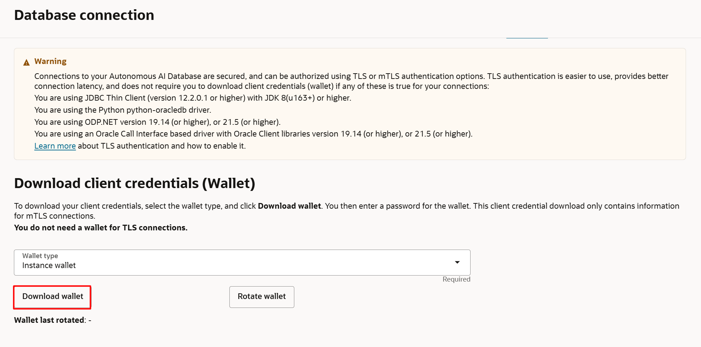
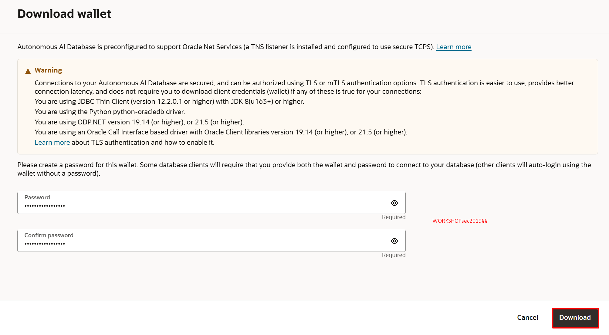

# Importar dados de demonstração para o workshop de Data Transforms

## Introdução

>⚠️ **ATENÇÃO** ⚠️
<br>
>**DOWNLOAD:** Faça o download do ZIP ([AQUI](https://objectstorage.sa-saopaulo-1.oraclecloud.com/p/aR4psHuDVUTRKxcK7ooD2JThAZg8ZrwHVM_qFKmSXsLSz_S_kXNkTBQ4QDOJy5VA/n/idi1o0a010nx/b/bucket-livelabs-engineering/o/livelabs.zip)), pois os arquivos serão utilizados nos laboratórios. Se você já realizou o download no primeiro laboratório, não é necessário realizar novamente.
<br>
>**SENHA:** Durante o provisionamento dos recursos, é necessário a criação de senhas. Utilize SEMPRE a senha recomendada: **WORKSHOPsec2019##**
<br>
> **COMPARTMENT:** Realize todos os provisionamentos FORA DO compartimento **ROOT**. Considere a criação dos recursos no compartimento criado anteriormente.

Este laboratório irá guiá-lo através dos passos para importar os dados de demonstração usados no restante do workshop. 

Tempo Estimado: 10 minutos

### Pré-requisitos
Para completar este laboratório, você deve já ter:

- Criado uma instância de Autonomous AI Database

## Tarefa 1: Criar usuários para o workshop



Conecte-se ao seu Autonomous AI Database como o usuário Admin e crie dois usuários da seguinte forma:

DT\_DEMO\_SOURCE será usado para armazenar os dados da origem que é um Object Storage. No workshop, carregaremos o Autonomous AI Lakehouse a partir dos dados de origem que é um Object Storage.

- Nome de usuário: DT\_DEMO\_SOURCE
- Quota: Ilimitada
- Funções: DWROLE, DATA\_TRANSFORM\_USER (Granted e Default ambas marcadas na UI)
- Acesso Web: ATIVADO

Você pode usar a UI de gerenciamento de usuários na página Database Actions, ou usar o SQL a seguir, para criar o usuário de origem. Faça login como o usuário Admin e execute o script copiando/colando na SQL Worksheet.

```
<copy>
CREATE USER DT_DEMO_SOURCE
  IDENTIFIED BY "WORKSHOPsec2019##"
  QUOTA 100M ON data;
GRANT DWROLE TO DT_DEMO_SOURCE;
GRANT DATA_TRANSFORM_USER TO DT_DEMO_SOURCE;
BEGIN
  ords.enable_schema(p_schema => 'DT_DEMO_SOURCE');
END;
/
</copy>
```




No restante do workshop, você se conectará como usuário DT\_DEMO\_SOURCE. Por favor, anote as URLs dos usuários para que você possa se conectar rapidamente como o usuário apropriado.

## Tarefa 2: Baixar o arquivo de carteira para o seu Autonomous AI Database

Conecte-se ao console do seu Autonomous AI Database no OCI e baixe o arquivo de carteira. Este arquivo será usado posteriormente para criar a conexão com o banco de dados.








Agora você pode **prosseguir para o próximo laboratório**.

## Agradecimentos

- Criado Por/Data - Jayant Mahto, Gerente de Produto, Autonomous AI Database, Janeiro 2023
- Contribuidores - Mike Matthews, Isabelle Anjos, Armando Neto
- Última Atualização Por - Armando Neto, Janeiro de 2026

Copyright (C)  Oracle Corporation.