# Configuração básica para o workshop de Data Transforms

## Introdução

>⚠️ **ATENÇÃO** ⚠️
 
>**DOWNLOAD:** Faça o download do ZIP ([AQUI](https://objectstorage.sa-saopaulo-1.oraclecloud.com/p/aR4psHuDVUTRKxcK7ooD2JThAZg8ZrwHVM_qFKmSXsLSz_S_kXNkTBQ4QDOJy5VA/n/idi1o0a010nx/b/bucket-livelabs-engineering/o/livelabs.zip)), pois os arquivos serão utilizados nos laboratórios. Se você já realizou o download no primeiro laboratório, não é necessário realizar novamente.
 
>**SENHA:** Durante o provisionamento dos recursos, é necessário a criação de senhas. Utilize SEMPRE a senha recomendada: **WORKSHOPsec2019##**
 
> **COMPARTMENT:** Realize todos os provisionamentos FORA DO compartimento **ROOT**. Considere a criação dos recursos no compartimento criado anteriormente.

Este laboratório irá guiá-lo para lançar o Data Transforms e realizar algumas etapas básicas de configuração antes de começarmos a criar pipelines de dados.

Tempo Estimado: 15 minutos

### Objetivos

Neste workshop, você aprenderá como:
-   Criar uma conexão
-   Importar as definições de suas entidades de dados
-   Criar um projeto

### Pré-requisitos

Para completar este laboratório, você precisa ter concluído os laboratórios anteriores, de modo que você tenha:

- Criado uma instância de Autonomous AI Lakehouse
- Baixado a carteira do banco de dados
- Criado o usuário DT\_DEMO\_SOURCE com os papéis apropriados

## Tarefa 1: Lançar o Data Transforms

1. Conecte-se como o usuário DT\_DEMO\_SOURCE e navegue até a página **Ações do Banco de Dados**. Clique na ferramenta **Data Transforms** na seção **Data Studio**.

    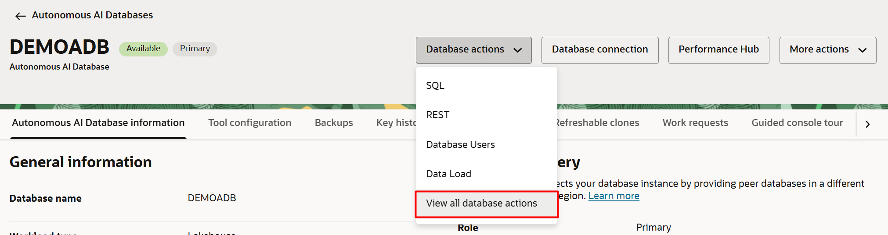

    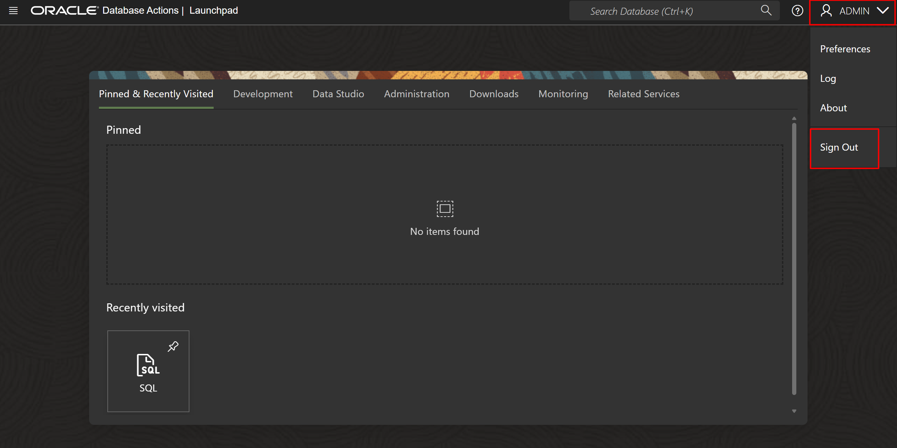

    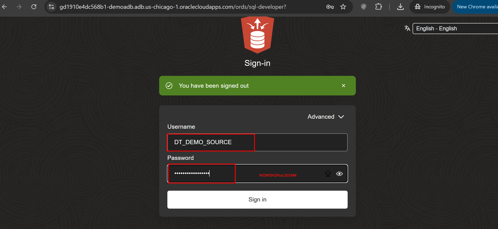

    

2. Insira o nome de usuário e a senha para DT\_DEMO\_SOURCE na tela de login e clique em **Conectar**. 

    

    Isso iniciará o serviço Data Transforms. O tempo de inicialização do serviço é de aproximadamente dois minutos. 
    
    > **Nota:** O serviço está ativo quando você está usando o Data Transforms e quando ele está executando um job agendado. Para economizar em custos de computação desnecessários, após alguns minutos de inatividade (por padrão 10 minutos), o serviço entra em modo de hibernação e é iniciado novamente quando você quiser usá-lo ou quando um job agendado em segundo plano é executado. Você pode controlar o tempo máximo de inatividade para o Data Transforms nas configurações de configuração do seu Autonomous AI Database no console OCI.

    

    Isso o levará à tela inicial do Data Transforms.

    

## Tarefa 2: Criar conexões

1. Na tela inicial, clique em conexões no menu do lado esquerdo. Isso mostra todas as conexões com suas fontes de dados. Por padrão, algumas conexões podem já ter sido criadas, mas criaremos nossas próprias conexões para este workshop.

    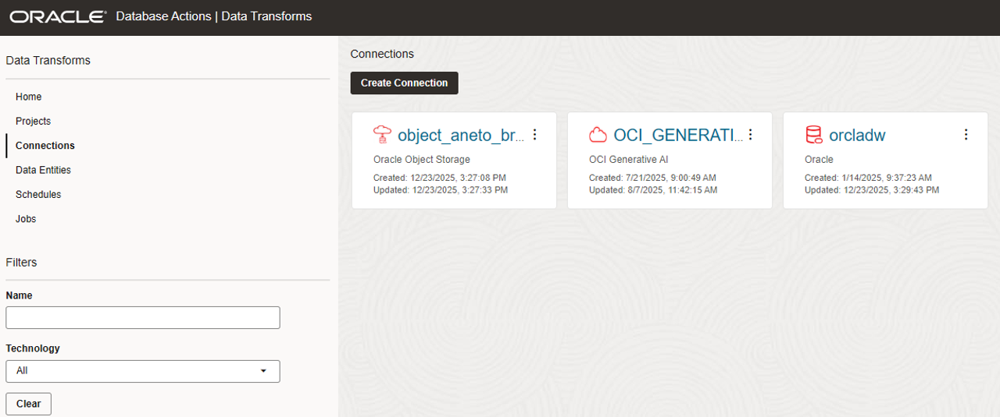

2. Clique em **Criar conexão**. Você verá todas as fontes de dados suportadas, organizadas em seções. O Data Transforms suporta conexões prontas para uso com mais de 100 fontes de dados. Muitas dessas conexões também podem ser usadas como alvo. Você pode consultar a documentação do Data Transforms para a lista completa e detalhes sobre como conectar.

    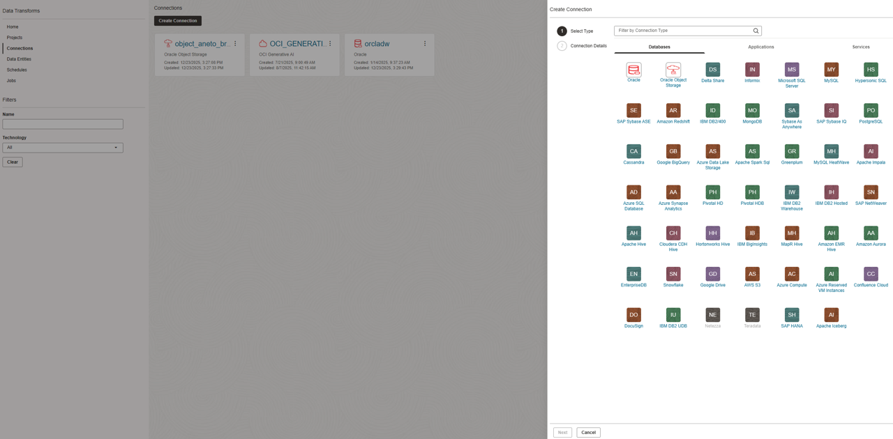

3. Para este workshop, usaremos o tipo de conexão Oracle Object Storage. Clique no ícone do Oracle Object Storage na lista e clique em **Próximo**.

    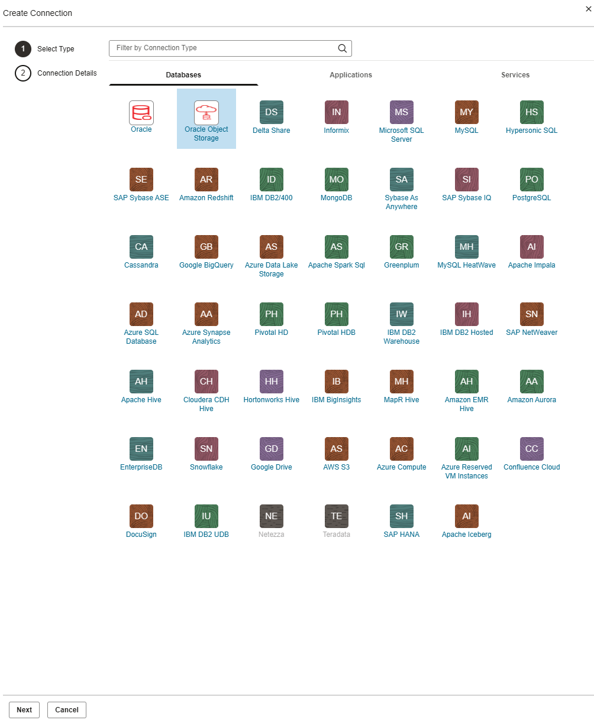

4. Forneça as informações de autenticação de conexão da seguinte forma:

    - Nome da Conexão: SOURCE\_BUCKET
    - Object Storage URL: https://>NAMESPACE<.objectstorage.us-chicago-1.oci.customer-oci.com/n/>NAMESPACE</b/bucket-bronze/o   (Para encontrar seu namespace, siga o LABORATÓRIO 5 TAREFA 3 ETAPAS 8 E 9 - salve a informação pois precisaremos dela depois)
    - Nome de Usuário: Dominio/NomeDoUsuario igual ao nome do IAM da Oracle Cloud (INFORMAÇÃO OBTIDA NO LAB 1 TAREFA 4 ETAPA 2 - SEU USUÁRIO ESTÁ EMBAIXO DE PROFILE)
    - Senha: AuthToken a ser gerado na console da cloud (INFORMAÇÃO DO LAB 1 TAREFA 4)

    Teste a conexão e clique em **Criar**.

    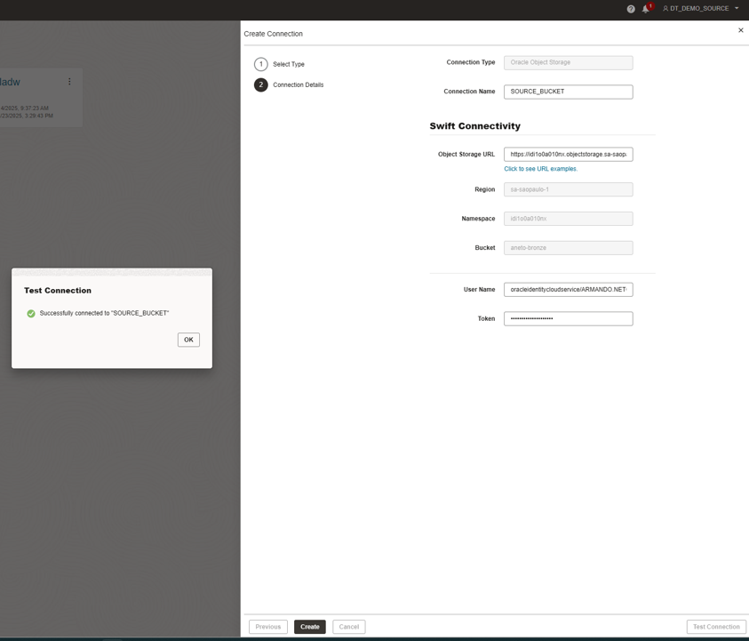

## Tarefa 3: Importar definições de entidades de dados

Agora temos toda a conectividade necessária para o workshop. Para criar pipelines de dados, o Data Transforms armazena uma cópia local das definições de entidades, como tabelas e views. Você pode importar inicialmente essas definições de entidades de suas conexões e, posteriormente, mantê-las sincronizadas periodicamente. 

Note que, uma vez importadas, as definições de entidades no Data Transforms são isoladas das alterações DDL nas fontes respectivas. Isso proporciona alguma flexibilidade no design dos processos de pipeline de dados. O usuário do Data Transforms está no controle de avaliar quaisquer alterações DDL na fonte e avaliar seu impacto nos processos existentes, e fazer atualizações apropriadas, antes de sincronizar as definições de entidades. Você também pode criar novas entidades no Data Transforms e executar fluxos de dados para criá-las como tabelas em um banco de dados conectado, ou simplesmente criar SQL inline como uma view armazenada apenas no Data Transforms.

1. Navegue até o menu **Entidades de Dados**

    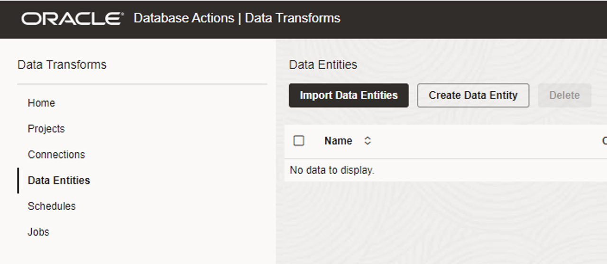

2. Clique em **Importar Entidades de Dados** e forneça as seguintes informações:

    - Conexão: SOURCE\_BUCKET
    - Esquema: bucket-bronze

    Clique em **Iniciar**. Isso iniciará um processo em segundo plano que leva algum tempo para ser concluído. 

    Note que você também pode fornecer uma máscara ou decidir entre tabelas/views para importar seletivamente as definições.

    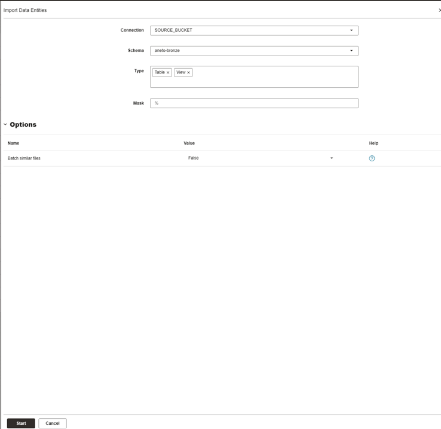

    Clique em **OK** na caixa de diálogo de notificação do job.

    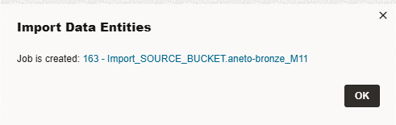

3. Navegue até o menu Jobs para monitorar o job de importação de entidades. Atualize a lista clicando no ícone de atualização no lado direito, conforme necessário.

    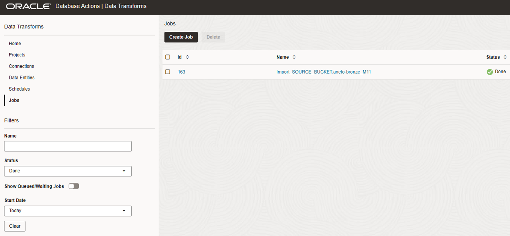

4. Após a conclusão bem-sucedida do job, volte ao menu **Entidades de Dados** e você deve conseguir ver as seguintes entradas de tabela:

    - CODIGO\_VIA
    - CODIGO\_NCM
    - EXPORTACAO\_BRASIL\_LIVELABS

    Note que quando usamos o conector do Oracle Object Storage ele funiona somente para arquivos no formato CSV, conforme documentação.

    Você pode usar o filtro do lado esquerdo (CONNECTION) para obter a lista com base em uma conexão ou filtro de nome parcial. Note que você pode ver mais algumas tabelas na lista dependendo da lista de tabelas no banco de dados de origem.

    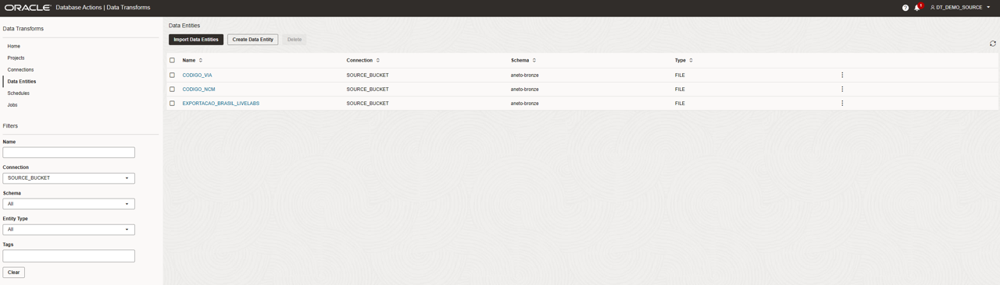

5. Você também pode usar o menu Ações (três pontos no lado direito do nome da entidade) para olhar as definições de entidades e visualizar os dados no menu do lado direito. Selecione EXPORTACAO\_BRASIL\_LIVELABS e clique em **Visualizar ou Preview** no menu Ações.

    Esta é a visualização de dados para a tabela EXPORTACAO\_BRASIL\_LIVELABS.

    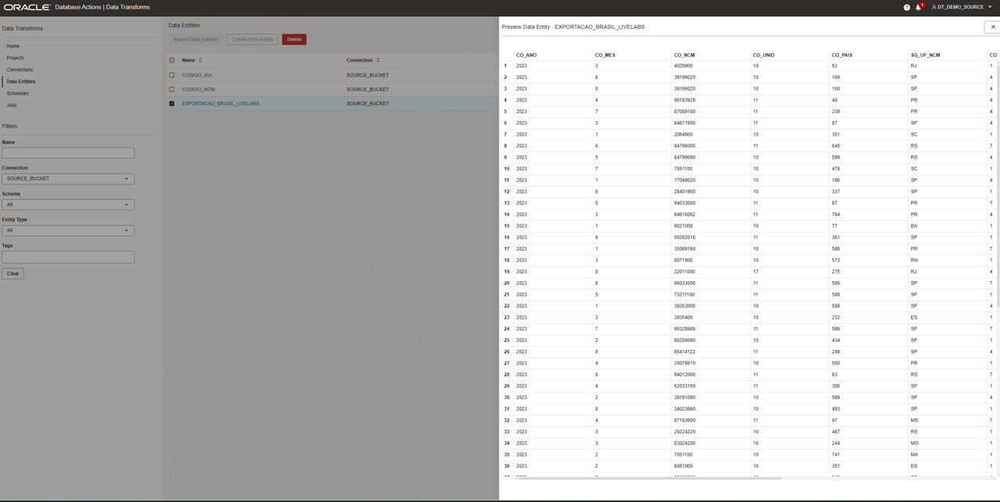

6. Agora será necessário alterar as definições da tabela EXPORTACAO\_BRASIL\_LIVELABS, clique em **Editar** no menu Ações.

    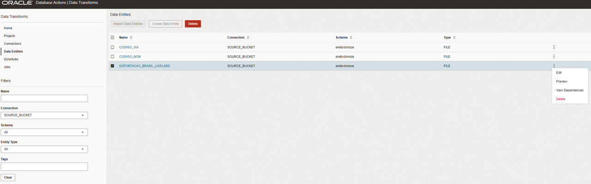

    Feito isso uma tela para editar a tabela se abrirá

    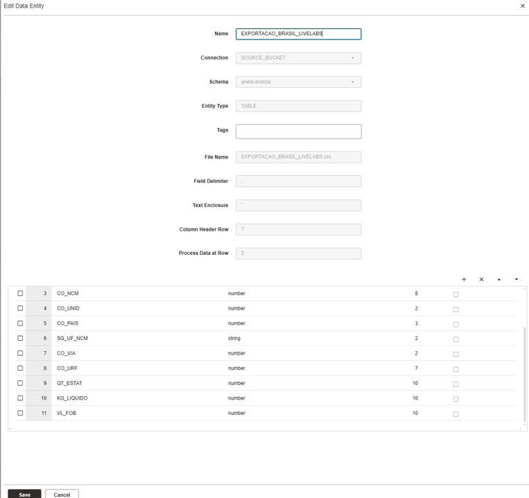

    Quando importamos os dados automaticamente o Data Transforms ele faz a inferência do DDL das tabelas com apenas uma amostra dos dados, logo isso pode gerar algumas inconsistências quando utilizamos essa inferência em origens de dados muito grandes, **no nosso caso precisamos alterar o tamanho das colunas QT\_ESTAT, KG\_LIQUIDO e VL\_FOB de 10 para 20, desça a página e altere estes componentes**, em seguida, clique em **Save**.

    

## Tarefa 4: Criar projeto

Projetos no Data Transforms ajudam a manter processos de pipeline de dados relacionados juntos.

1. Crie um novo projeto. Usaremos isso para nosso workshop.

    Clique no menu Projeto.

    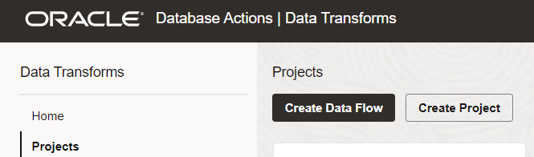

    Clique em **CRIAR PROJETO, NÃO CLIQUE EM CRIAR DATA FLOW**. Digite MY\_WORKSHOP e clique em **Criar**.

    Note que você pode criar diretamente um fluxo de dados a partir deste menu clicando no botão **Criar Fluxo de Dados**. Para este workshop, configuraremos um projeto primeiro e depois começaremos a criar componentes de pipeline de dados.

    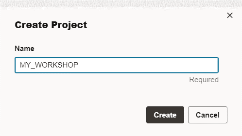

## RECAPITULAÇÃO

Neste laboratório, lançamos o serviço Data Transforms e concluímos a configuração básica de criação de conexões, importação de definições de entidades e criação de um projeto.

Agora você pode **prosseguir para o próximo laboratório**.

## Agradecimentos

- Criado Por/Data - Jayant Mahto, Gerente de Produto, Autonomous AI Database, Janeiro de 2023
- Contribuidores - Mike Matthews, Isabelle Anjos, Armando Neto
- Última Atualização Por - Armando Neto, Janeiro de 2026

Copyright (C)  Oracle Corporation.
