# Carregando os dados do Object Storage para o Autonomous AI Database

## Introdução

>⚠️ **ATENÇÃO** ⚠️
 
>**DOWNLOAD:** Faça o download do ZIP ([AQUI](https://objectstorage.sa-saopaulo-1.oraclecloud.com/p/aR4psHuDVUTRKxcK7ooD2JThAZg8ZrwHVM_qFKmSXsLSz_S_kXNkTBQ4QDOJy5VA/n/idi1o0a010nx/b/bucket-livelabs-engineering/o/livelabs.zip)), pois os arquivos serão utilizados nos laboratórios. Se você já realizou o download no primeiro laboratório, não é necessário realizar novamente.
 
>**SENHA:** Durante o provisionamento dos recursos, é necessário a criação de senhas. Utilize SEMPRE a senha recomendada: **WORKSHOPsec2019##**
 
> **COMPARTMENT:** Realize todos os provisionamentos FORA DO compartimento **ROOT**. Considere a criação dos recursos no compartimento criado anteriormente.

Este laboratório apresenta como o Data Transforms pode ajudar você a configurar um fluxo de carga de dados de uma fonte para um destino sem quaisquer transformações.

Tempo Estimado: 30 minutos

### Objetivos

Neste workshop, você aprenderá como:
- Extrair dados de múltiplas tabelas em uma fonte e carregá-los para tabelas correspondentes no destino sem qualquer transformação.

### Pré-requisitos

Para completar este laboratório, você precisa ter concluído os laboratórios anteriores, de modo que você tenha:

- Criado uma instância de Autonomous AI Lakehouse
- Criado o usuário DT\_DEMO\_SOURCE com os papéis apropriados
- Iniciado a ferramenta Data Transforms e realizado o seguinte:
    - Criado a conexão SOURCE
    - Importado as definições de entidades
    - Criado um projeto chamado MY\_WORKSHOP

## Tarefa 1: Criar um job de carga de dados

Nesta tarefa, criaremos três fluxos de carga de dados para extrair as tabelas CODIGO\_VIA, CODIGO\_NCM e EXPORTACAO\_BRASIL\_LIVELABS do nosso Object Storage e carregar no Autonomous AI Database.

1. CLIQUE NO NOME DO PROJETO PARA ENTRAR, selecione **Data Flows** no menu à esquerda e clique em **Create Data Flow**.

    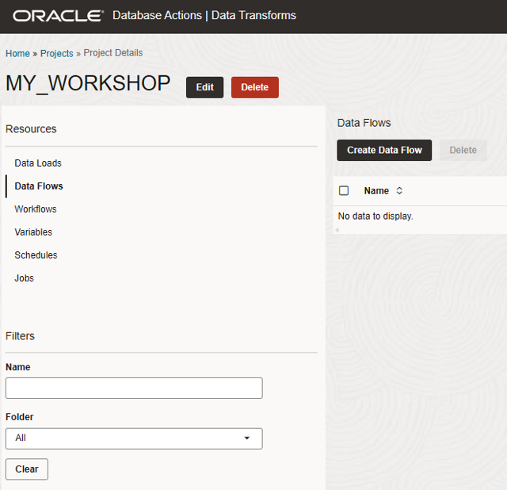

2. Insira o nome do fluxo de carga de dados como DataFlow\_ExportacaoBrasil e clique em **Criar**.

    

3. Feito isso aparecerá uma tela para selecionarmos um Schema, iremos selecionar a conexão SOURCE\_BUCKET e o Schema bucket-bronze e clique em **OK**.

    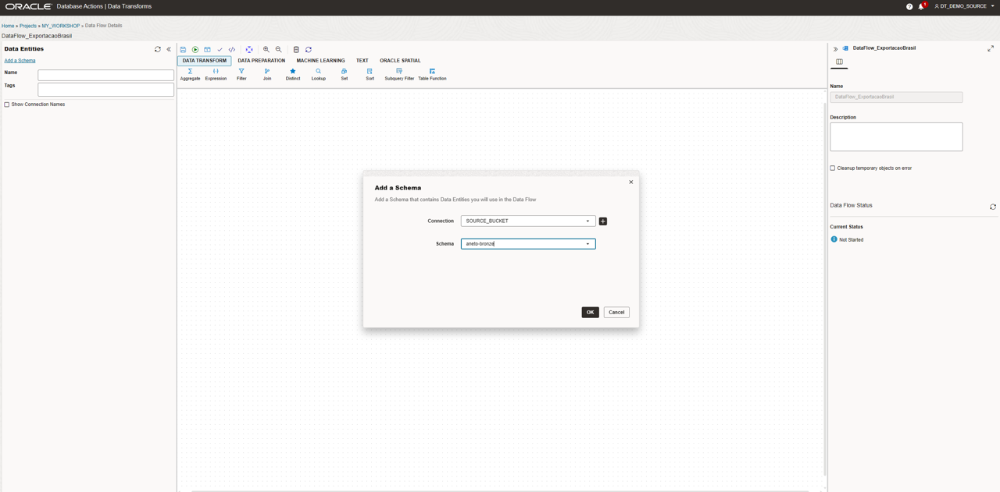

4. Feito isso vamos "pegar e arrastar" a tabela EXPORTACAO\_BRASIL\_LIVELABS para a tela.

    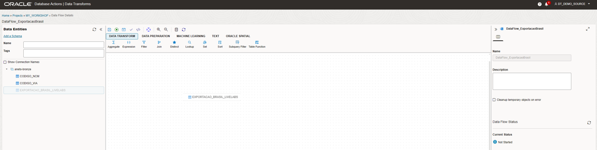

    Note que cada Data Flow pode ter N tabelas de origem mas apenas uma tabela de destino, no caso do laboratório em questão teremos que criar mais dois data flows para as tabelas CODIGO\_VIA e CODIGO\_NCM.

5. Após a tabela aparecer na área de desenvolvimento do Data Flow, clique no ícone que apareceu no centro da tela. Em seguida, clicaremos no simbolo de tabela com um + para a criação da entidade de destino, lembrando que tudo isso ainda existe apenas dentro do Data Transforms.

    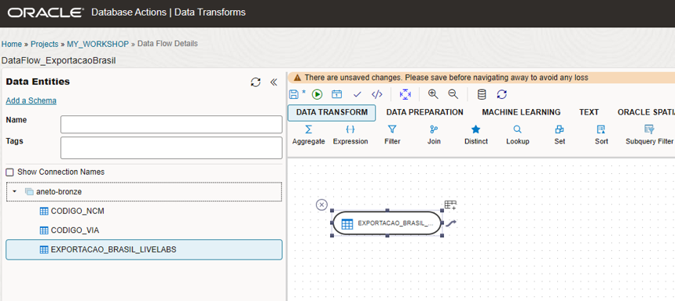

6. Feito isso, aparecerá uma tela de criação de uma nova entidade de dados, preencha conforme informações abaixo, após preenchido clique **Próximo**:

    - Nome: EXPORTACAO\_BRASIL
    - Tipo da Entidade: Tabela
    - Tipo da Conexão: Oracle
    - Conexão: NomeDoSeuBanco
    - Schema: DT\_DEMO\_SOURCE

    >**ATENÇÃO:** Caso apareça o erro abaixo, siga as instruções indicadas. **USUÁRIO:** DT\_DEMO\_SOURCE **SENHA:** WORKSHOPsec2019##

    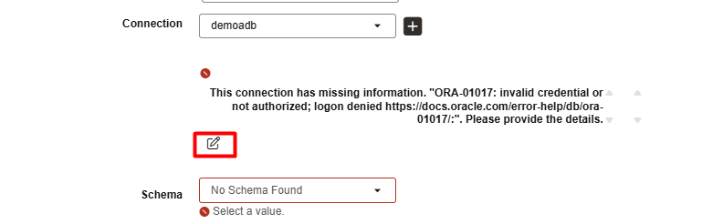

    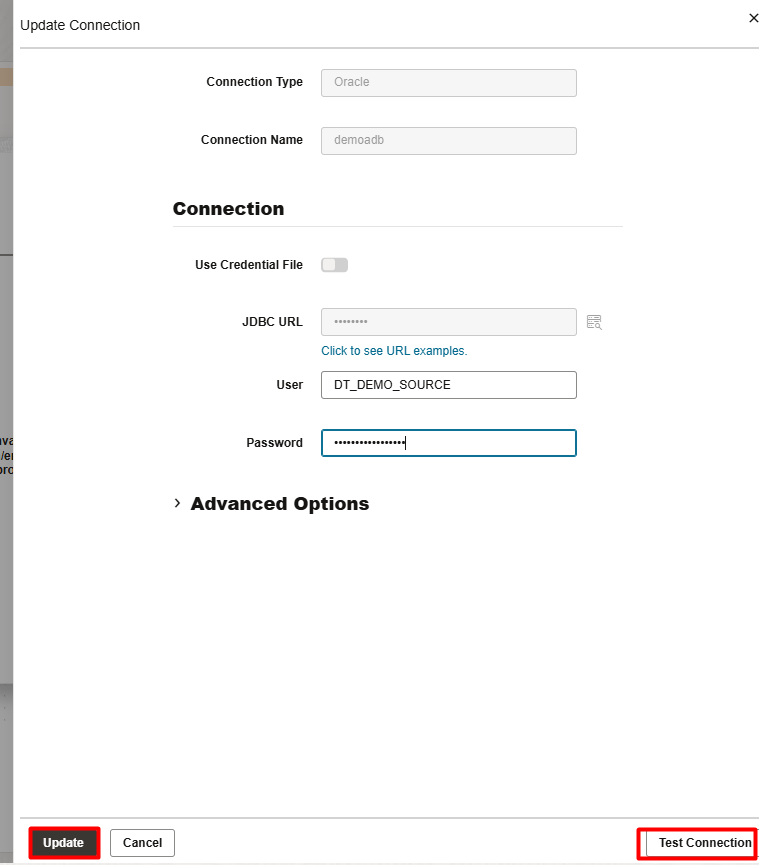

    Clique em **Next**

    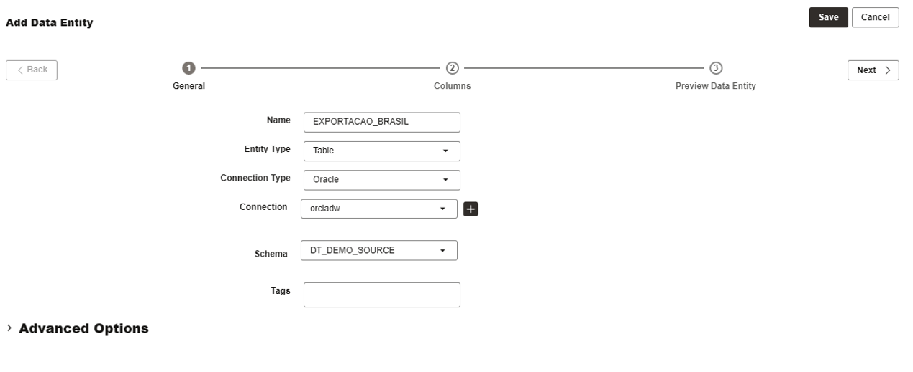

    Neste segundo passo você pode adicionar, remover ou editar as colunas inferidas baseado no DDL dos dados da origem, **valide que as colunas QT\_ESTAT, KG\_LIQUIDO e VL\_FOB que foram alteradas na origem, essas alterações foram herdadas nessa tabela de destino**, validado isso clique em **Próximo**.
    
    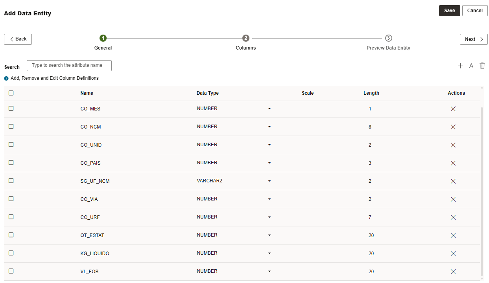

    Neste ultimo passo é apenas uma pré visualização de como ficará a tabela no destino, clique em **Salvar**

    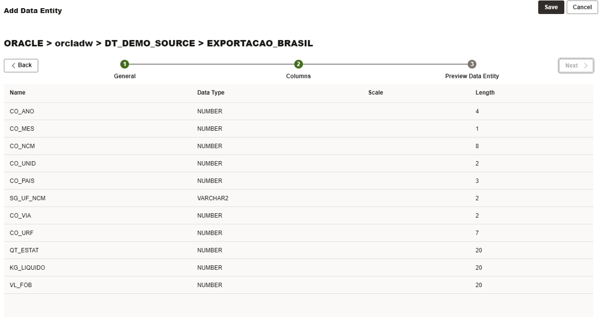

7. Feito isso o seu fluxo de dados aparecerá dessa maneira:

    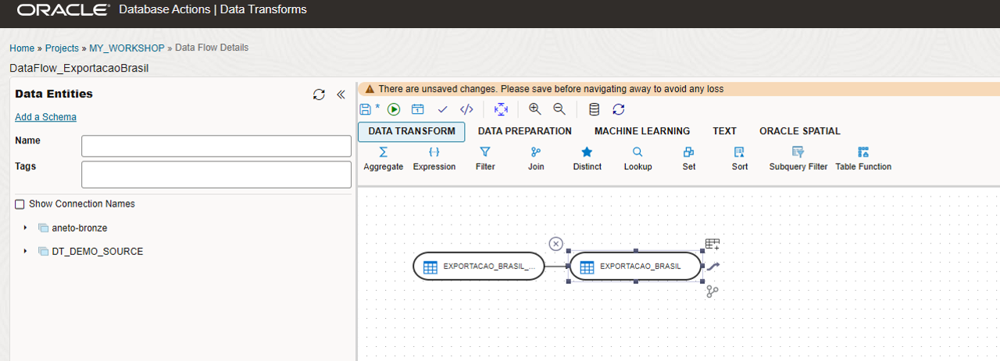

    Agora clique no botão de **Salvar** (Simbolo de um Disquete), para que o seu fluxo de dados fique dessa maneira e após isso execute o Fluxo de dados clicando no botão **Executar** (Simbolo de Play)

    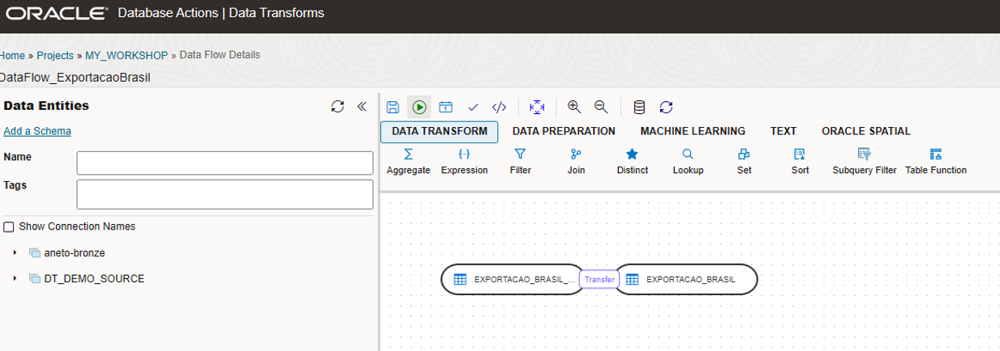

    Uma janela de confimação aparecerá, clique em **Iniciar**

    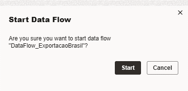

    Clicado em iniciar aparecerá uma nova janela informando que um Job de execução foi criado, é possível clicar no Job e monitora-lo ou clicar no botão OK e essa janela se fechará, clique no **Hyperlink do Job** para abrir a tela de monitoramento do Job.

    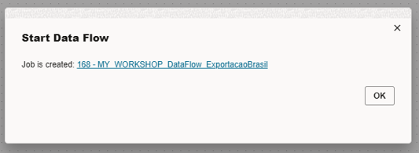

8. Na Pagina de detalhes do Job é possível monitorar toda a execução do fluxo de dados criado, ver se ele foi completo com sucesso ou se houve algum erro, por aqui é onde pode-se fazer o "debugging" do seu fluxo de dados, a atualização do andamento do Job não é automatica para atualizar clique no simbolo de atualizar no canto superior direito

    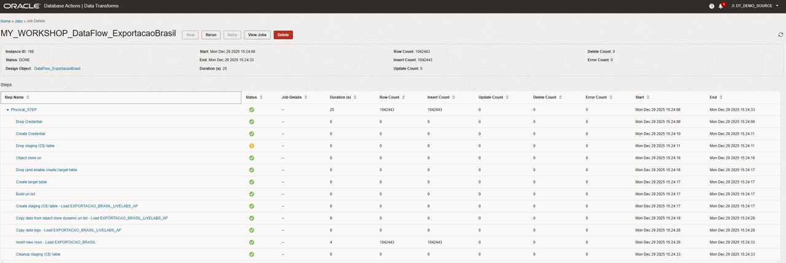

9. **Repita os passos 1 até o 7 para as tabelas CODIGO\_VIA e CODIGO\_NCM**

## Tarefa 2: Visualização dos dados carregados

1. Acesse novamente o Database actions e clique em **View all database actions**.

    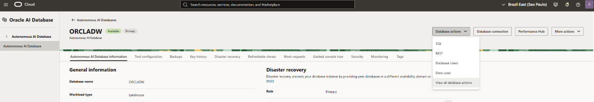

2. Faça o log out do usuário ADMIN.

    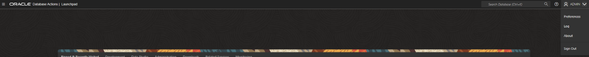

3. Acesse com o usuário DT\_DEMO\_SOURCE

    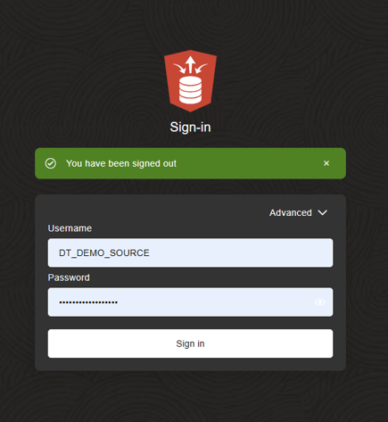

4. Vá no menu Hamburguer (Canto superior esquerdo) e clique em **SQL** opção do menu de Desenvolvimento.

    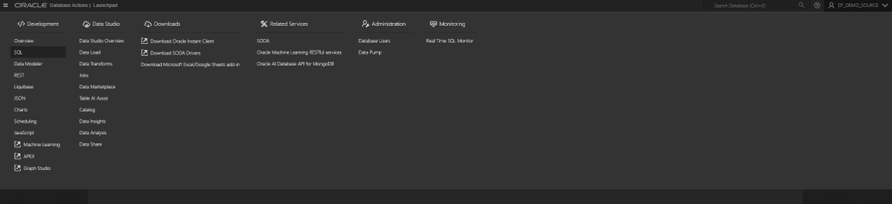

5. No painel SQL "pegue e arraste" a tabela EXPORTACAO\_BRASIL para a Worksheet.

    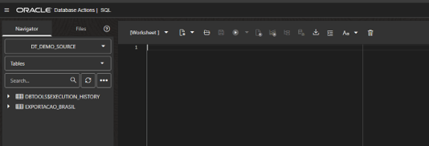

6. Uma janela se abrirá escolha a opção Select e depois clique em **Apply**.

    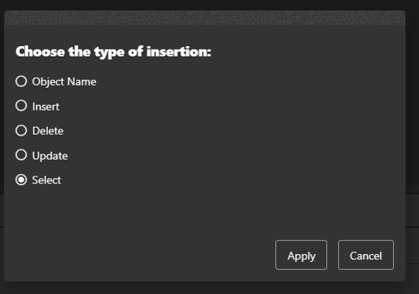

7. Automaticamente será criado um Select de todas as colunas da tabela na Worksheet, execute clicando no botão com desenho do simbolo play ou utilizando o atalho control + enter 

    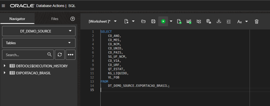

8. Visualize os dados carregados pelo seu processo de fluxo de dados criado pelo Data Transforms.

    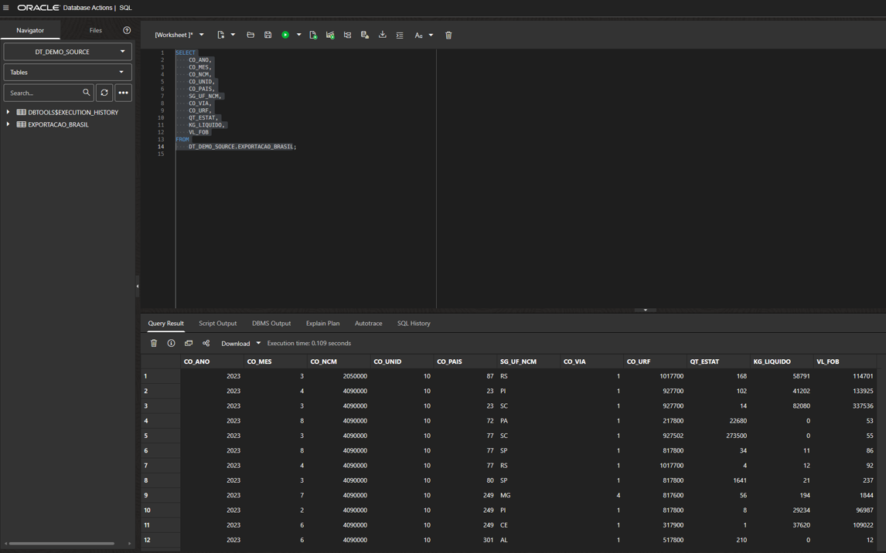

## RECAPITULAÇÃO

Neste laboratório, usamos o Data Transforms para extrair múltiplas tabelas de Object Storage fonte e carregá-las no destino. Executamos este job de carga de dados como um processo ad-hoc. Na prática, esses jobs são agendados para executar em frequência regular, e execuções subsequentes extrairão e carregarão todas as linhas para que seja incremental é necessário aplicar logicas a mais no fluxo de dados (carga incremental é aquela que adiciona ou modifica os dados desde a última execução).

Você pode agora **prosseguir para o próximo laboratório**.

## Agradecimentos

- Criado Por/Data - Jayant Mahto, Gerente de Produto, Autonomous AI Database, Janeiro 2023
- Contribuidores - Mike Matthews, Isabelle Anjos, Armando Neto
- Última Atualização Por - Armando Neto, Janeiro de 2026

Copyright (C)  Oracle Corporation.